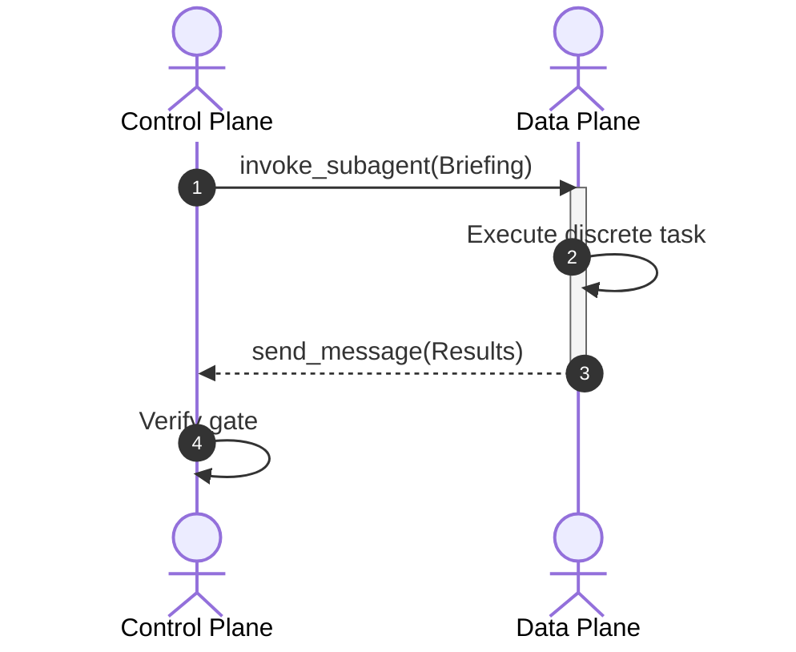

# Mermaid Diagrams (Rapid Linear & Sequence Modeling)

This skill governs the authoring, syntax verification, and lifecycle of Mermaid markdown diagrams in posts, articles, and documentation.

## 1. Supported Diagram Archetypes
Mermaid is strictly reserved for simple, rapid, declarative flow representations:
- **Sequence Diagrams (`sequenceDiagram`)**: Request-response flows, subagent handshakes, message lifecycles, API calls between 2–4 participants.
- **State Diagrams (`stateDiagram-v2`)**: FSMs, status lifecycles, phase gates with simple sequential or fork/join states.
- **Entity Relationship Diagrams (`erDiagram`)**: Compact database entity schemas, relational cardinality (1:1, 1:N).
- **Linear Flowcharts (`graph LR` / `flowchart TD`)**: Simple linear pipelines with 3–5 total nodes.

## 2. Mermaid Syntax & Rendering Rules
To prevent client-side parse errors and visual glitches:
- **Quote Node Labels**: Always enclose label text containing parentheses, square brackets, quotes, or colons in double quotes:
  ```mermaid
  flowchart LR
    A["Client Request (HTTP/2)"] --> B["API Gateway"]
  ```
- **Avoid HTML in Labels**: Do not use raw HTML tags (`<br/>`, `<span>`, `<div>`) in Mermaid nodes. Use standard Mermaid newline syntax or distinct sub-nodes.
- **Explicit Orientation**: Always declare orientation explicitly (`LR` for left-to-right pipelines, `TD` for top-down hierarchies).

## 3. Styling & Theme Integration (`src/styles/diagrams.css`)
Mermaid diagram rendering styles, typography resets, and dark/light mode switching are centralized in `src/styles/diagrams.css` (imported globally by `src/styles/theme.css`):
- **Dual-Theme Rendering**: Client-side theme switching toggles `.mermaid-svg.mermaid-light` and `.mermaid-svg.mermaid-dark` automatically based on `:root.light` and `.light`.
- **Typography & Font Consistency**: Standardized to `"Inter", system-ui, -apple-system, sans-serif` without layout shifts.
- **Label Box Margin Reset**: Enforces zero margins on paragraph tags inside `.mermaid-svg` to prevent bloated node boxes.

## 4. The Strict Escalation Gate (Mermaid -> SVG)
Mermaid diagrams suffer from unpredictable text sizing, rigid auto-layouts, clipping on mobile screens, and lack of dark/light theme tokens when complex.

**MANDATORY ESCALATION RULE**:
Escalate immediately from `mermaid-diagrams` to `svg-graphics` when ANY of the following triggers are met:
1. **Node Count Threshold**: The diagram contains **more than 4–5 nodes** or multiple branching paths.
2. **Descriptive Annotations**: Nodes require multi-line explanations, code snippets, or descriptive prose rather than concise labels (1–3 words).
3. **Styling & Theming Needs**: The graphic requires custom brand colors, drop shadows, glow effects, or strict light/dark theme adaptation.
4. **Layout Fragility**: Auto-layout results in overlapping connector lines, tangled arrows, or micro-fonts that degrade readability on mobile displays.

When escalating, follow `svg-graphics` to construct a deterministic inline SVG.

## 5. Example: Valid Sequence Flow


## 6. Verification & Pre-Flight Checks
- Review syntax inside code fences ` ```mermaid `.
- Verify that participants and aliases are consistently named.
- Ensure no circular reference loops deadlock the renderer.
