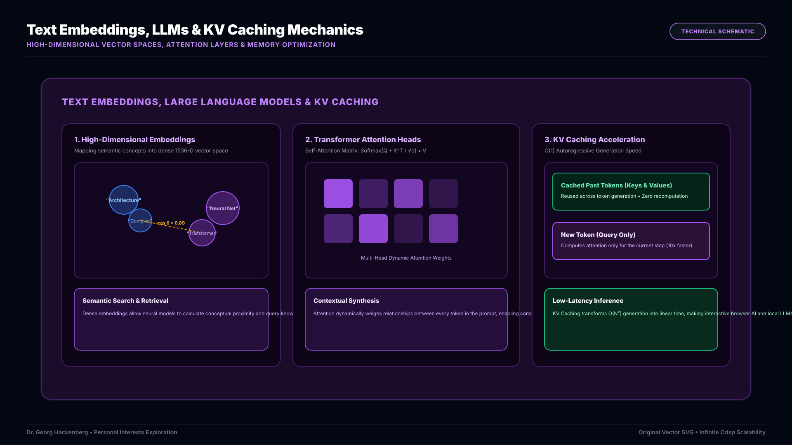
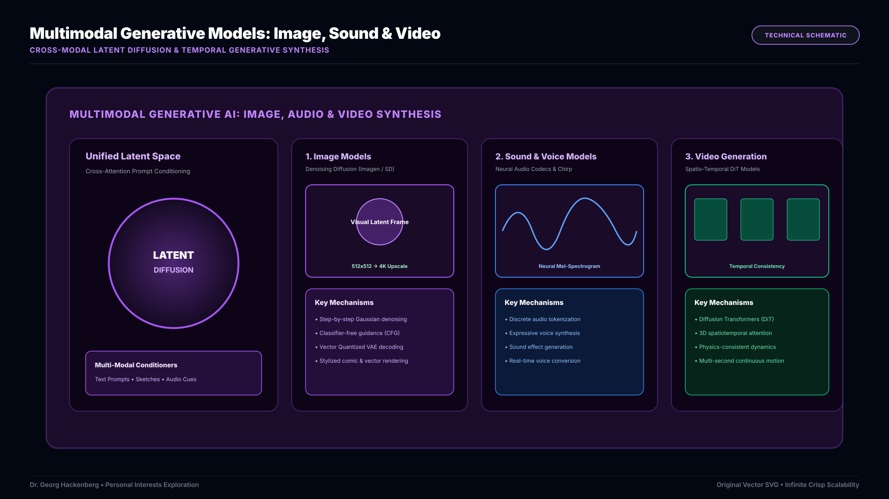
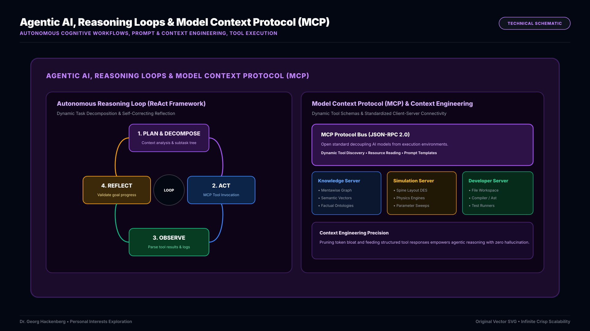

Artificial Intelligence represents one of the most exhilarating frontiers in computer science. What excites me most is the profound shift from rigid, deterministic rule-based algorithms to semantic, adaptive neural architectures capable of synthesizing knowledge, generating rich multimodal media, and reasoning autonomously to solve complex open-ended problems.

## 1. Semantic Foundations: Embeddings, LLMs & KV Caching

Modern AI breakthroughs are rooted in high-dimensional **text embeddings** and Transformer-based **Large Language Models (LLMs)**. By projecting human language and structural ontologies into dense mathematical vector spaces, semantic similarity, conceptual clustering, and contextual nuance can be calculated directly.

*Figure 1: High-dimensional vector embeddings, multi-head Transformer self-attention layers, and Key-Value (KV) caching acceleration.*

Inside Transformer architectures, multi-head self-attention dynamically weighs relationships between every token across deep context windows. To make real-time, interactive generation viable—especially in resource-constrained or local browser environments—**KV caching (Key-Value Caching)** is essential. By caching previously computed keys and values in GPU memory, token generation complexity drops from $O(N^2)$ to $O(1)$ per step, enabling instantaneous streaming responses.

## 2. Multimodal Generation: Image, Sound & Video Synthesis

Generative AI has expanded far beyond text processing into cross-modal synthesis. Generative architectures—spanning latent diffusion models, flow matching, and autoregressive transformer backbones—now synthesize diverse sensory modalities with astonishing fidelity.

*Figure 2: Unified latent diffusion space branching into specialized generative pipelines for high-resolution images, neural audio synthesis, and temporal video generation.*

* **Image Generation Models**: Step-by-step Gaussian denoising in compressed latent spaces translates text prompts and sketches into stylized comic art, technical diagrams, and photorealistic graphics.
* **Sound & Voice Generation Models**: Neural audio codecs and continuous spectrogram diffusion generate expressive synthetic speech, adaptive soundscapes, and acoustic simulations.
* **Video Generation Models**: Spatiotemporal Diffusion Transformers (DiTs) model physics, camera trajectories, and temporal consistency across consecutive video frames.

## 3. Autonomous Agency: Reasoning Loops, MCP & Context Engineering

The ultimate frontier of AI is transitioning from passive chatbots to active, goal-oriented **Agentic AI**. Rather than generating a single static response, modern autonomous agents operate inside continuous **reasoning loops** (such as ReAct: *Plan $\rightarrow$ Act $\rightarrow$ Observe $\rightarrow$ Reflect*).

*Figure 3: Autonomous ReAct reasoning loop integrated with the Model Context Protocol (MCP) bus and precision context engineering.*

Building dependable AI agents requires two fundamental pillars:
* **Prompt & Context Engineering**: Managing the agent's working memory, compressing relevant history, and dynamically injecting structured facts from knowledge graphs to eliminate hallucinations and preserve accuracy.
* **Model Context Protocol (MCP)**: A powerful open standard that decouples AI reasoning from external systems. Through MCP servers, AI agents can dynamically discover tools, read local file systems, query databases, execute compilers, and invoke simulation engines safely and securely.
