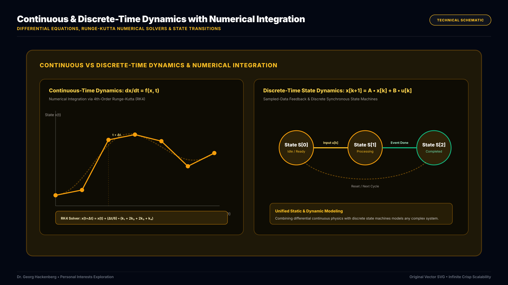
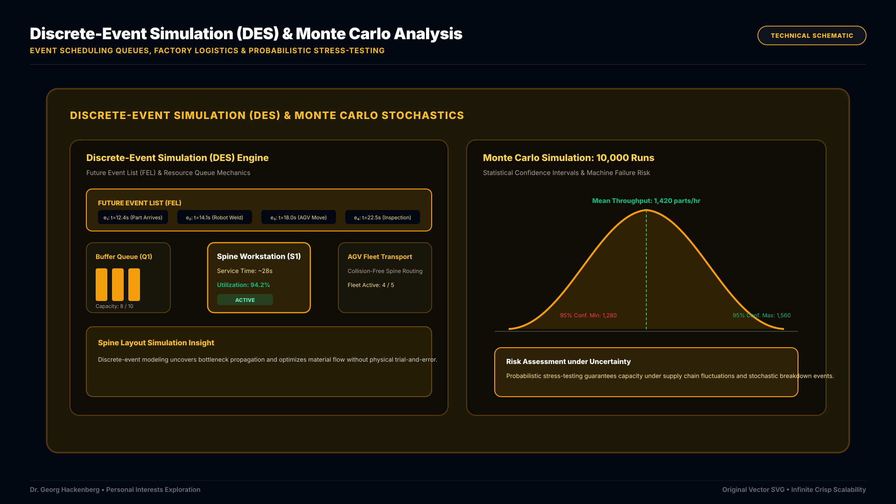
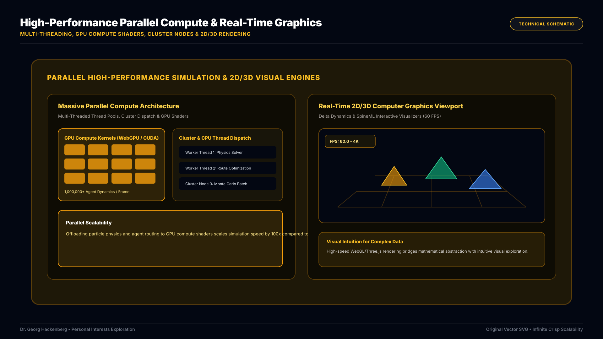

Computer simulation is nothing short of a computational time machine. It grants us the extraordinary ability to construct virtual laboratories, observe emergent non-linear dynamics, and rigorously evaluate millions of design scenarios—long before committing physical capital, building factory lines, or deploying mission-critical infrastructure.

## 1. Mathematical Foundations: Continuous & Discrete-Time Dynamics

At the heart of simulation lies the balance between **static models** (which capture structural relations, geometric footprints, and equilibrium states) and **dynamic models** (which trace how systems evolve over time).

Physical processes—such as fluid flow, thermodynamics, and mechanical motion—operate under **continuous-time dynamics** governed by systems of non-linear differential equations ($\frac{dx}{dt} = f(x, t)$). Solving these systems requires advanced **numerical integration** algorithms (such as 4th-order Runge-Kutta or symplectic solvers) to compute trajectory approximations with tight error bounds.

*Figure 1: Continuous-time differential dynamics solved via 4th-Order Runge-Kutta (RK4) numerical integration alongside discrete-time state transition dynamics.*

In contrast, cyber-physical controllers, digital logic, and sampled-data systems operate under **discrete-time dynamics** ($x[k+1] = A \cdot x[k] + B \cdot u[k]$). Simulating modern industrial systems requires harmonizing continuous physical plant dynamics with discrete digital control loops in unified simulation environments.

## 2. Managing Uncertainty: Discrete-Event & Monte Carlo Methods

Industrial manufacturing, supply chains, and transportation networks are inherently asynchronous, queue-based, and stochastic.

In **Discrete-Event Simulation (DES)**, state variables do not change smoothly with continuous time; instead, they transition instantaneously at discrete points where events occur (e.g., a part arrives at a buffer, a machine completes a weld, or an automated guided vehicle changes tracks). By maintaining an efficient *Future Event List (FEL)* priority queue, DES allows us to simulate months of factory operations, evaluate specialized layout topologies (such as spine layouts), and identify subtle bottleneck propagations in just seconds of compute time.

*Figure 2: Discrete-Event Simulation (DES) engine with Future Event List scheduling and Monte Carlo statistical distribution analysis.*

To evaluate risk and operational resilience under real-world variability (e.g., stochastic machine breakdowns or fluctuating customer demand), we deploy **Monte Carlo simulation**. By running tens of thousands of randomized runs across parametric probability distributions, we derive statistical confidence intervals, uncover black-swan edge cases, and design robust operating policies.

## 3. High-Performance Compute & Real-Time 2D/3D Graphics

Modern simulation models demand immense computational horsepower. Simulating large-scale logistics networks or high-fidelity physical phenomena pushes beyond single-threaded CPU limits.

*Figure 3: Massive parallel compute architecture leveraging GPU shaders, multi-threaded CPU worker pools, cluster nodes, and real-time 2D/3D visual rendering.*

We harness high-performance computing paradigms across every layer:
* **Multi-Threading**: Distributing independent entity calculations and physics solvers across multicore CPUs via lock-free worker pools.
* **Cluster Programming**: Partitioning massive parameter sweeps and distributed Monte Carlo batches across compute clusters.
* **GPU Programming (WebGPU / CUDA)**: Massively parallel compute shaders simulate millions of interacting agents and particle dynamics simultaneously.
* **2D & 3D Computer Graphics**: Rendering dynamic simulation states in real-time WebGL viewports (such as in *Delta Dynamics* and *SpineML*) provides engineers and stakeholders with immediate visual intuition, transforming raw mathematical telemetry into clear, explorable insights.
