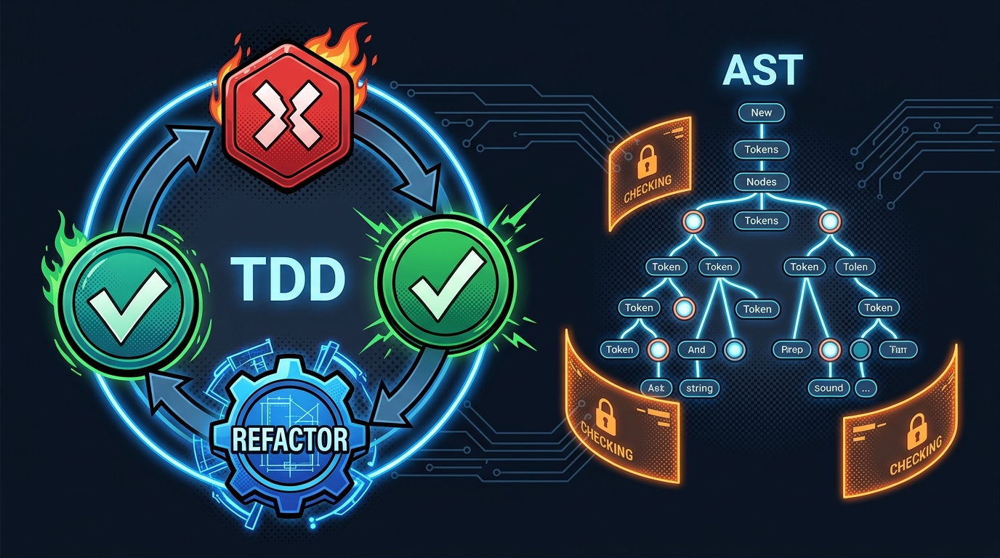
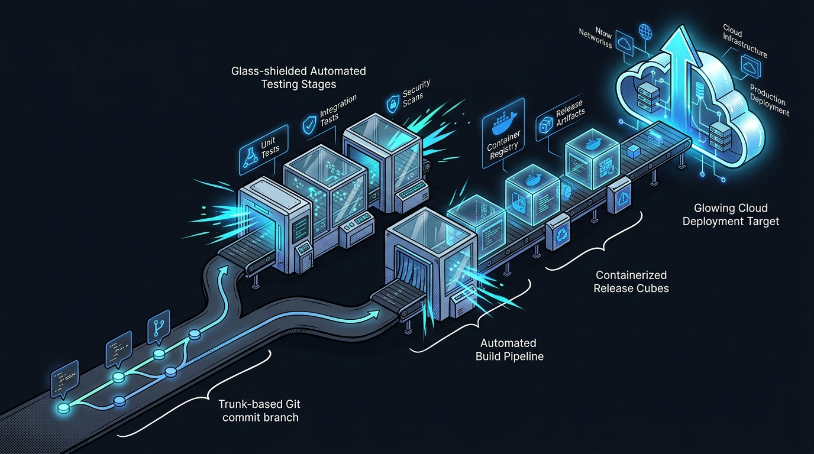
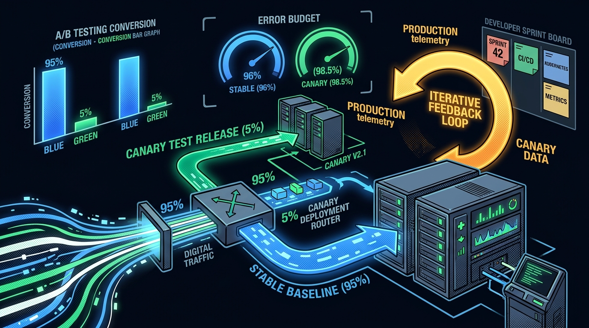

Software engineering is fundamentally the art and science of taming complexity. What excites me most about this discipline is the ability to construct intricate, reliable systems from pure thought—translating abstract human requirements into robust, high-performance architectures that scale effortlessly and operate deterministically.

## 1. Crafting Quality from Within: TDD & Static Analysis

Writing code should never be an act of hopeful guesswork. High-assurance software engineering begins with **iterative and incremental development**, where large and ambiguous problems are broken down into manageable, testable increments.

A core foundation of my development philosophy is **Test-Driven Development (TDD)**. By writing unit tests before implementation, we force ourselves to clarify system specifications and interface contracts up front. The classic *Red-Green-Refactor* cycle provides immediate psychological safety: code is proven correct at every step, and refactoring becomes a confident exercise in architectural refinement rather than a source of anxiety.

*Figure 1: The Test-Driven Development (TDD) cycle combined with Abstract Syntax Tree (AST) static analysis and automated quality gates.*

Alongside unit testing, **static code analysis** acts as an automated compiler-level guardian. By parsing source code into Abstract Syntax Trees (ASTs), static analyzers and sound type systems (such as TypeScript or Rust) eliminate entire classes of runtime defects—such as null dereferences, concurrency race conditions, and architectural boundary violations—before a single line of code ever runs.

## 2. Frictionless Automation: Version Control & CI/CD

The true joy of modern software engineering lies in automated pipelines that remove human friction from the delivery lifecycle. Modern engineering relies on **version control** (Git) as an immutable, collaborative timeline of architectural decisions.

*Figure 2: End-to-end automated Continuous Integration (CI) and Continuous Delivery (CD) pipeline from trunk-based Git commit to staged deployments.*

When version control is married to **Continuous Integration (CI)** and **Continuous Delivery (CD)**:
* **Automated Verification**: Every pull request triggers clean, containerized builds, runs comprehensive test suites, and executes static linters.
* **Deterministic Artifacts**: Code is packaged into immutable, signed releases that can be reliably staged and audited.
* **Frictionless Velocity**: Developers can focus on creative problem-solving and domain logic, confident that automated guardrails protect system stability.

## 3. Empirical Feedback: Canary Releases, A/B Testing & Usability Engineering

Shipping software is not the end of the engineering journey; it is the beginning of empirical validation. Software does not exist in a vacuum—it exists to serve human beings. This is where **usability engineering** and **user-centered design (UCD)** intersect with production infrastructure.

*Figure 3: Progressive canary deployment routing, live A/B testing telemetry, and user-centered design feedback loops.*

Using modern deployment strategies, we can test architectural and product hypotheses with real users under live conditions:
* **Canary Releases**: New releases are initially exposed to a tiny fraction (e.g., 5%) of live traffic. Real-time telemetry, error budgets, and performance metrics ensure any anomaly triggers an instant, zero-downtime rollback before affecting the broader user base.
* **A/B Testing**: Controlled experiments scientifically measure conversion rates, user engagement, and workflow completion times across interface variants.
* **Usability Feedback Loops**: Qualitative user feedback and quantitative behavioral analytics feed directly back into sprint planning, driving continuous, user-centered refinement.

By unifying rigorous compile-time type safety, automated continuous delivery, and empirical usability telemetry, software engineering becomes an exceptionally fulfilling discipline where theory and practice harmonize to create enduring value.
