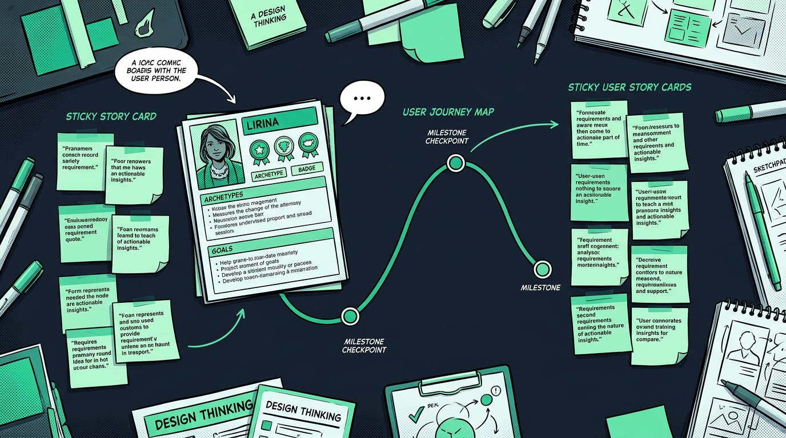
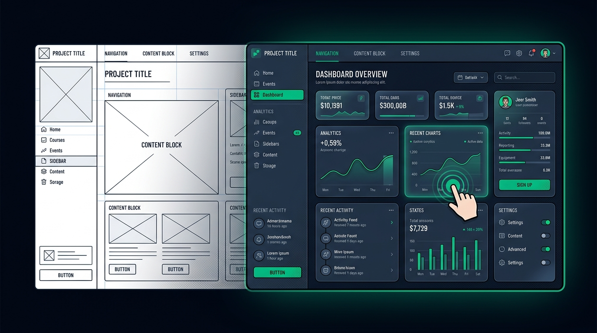
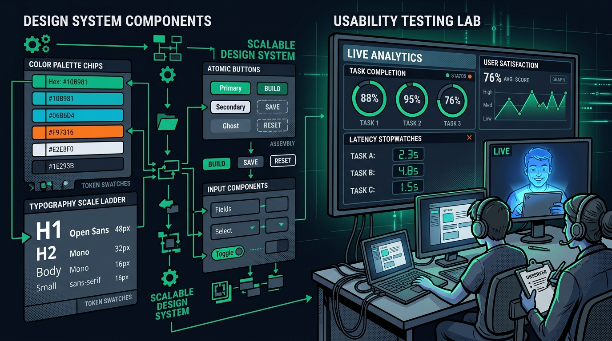

User Experience (UX) is the bridge where complex engineering meets human cognition. Even the most sophisticated algorithms and distributed architectures are ineffective if users cannot understand them, navigate them intuitively, and extract value from them without cognitive fatigue. What excites me most is designing interfaces that make complex, multidimensional data structures—such as large-scale knowledge graphs, 3D CAD files, and simulation parameters—effortless and delightful for visual thinkers to explore.

## 1. Grounded Empathy: UCD, Personas, Scenarios & User Stories

Exceptional software never begins with arbitrary wireframes; it begins with deep user empathy and structured **User-Centered Design (UCD)**.

*Figure 1: User Persona definition, structured User Stories and Use Cases, and end-to-end scenario journey mapping.*

To ground design decisions in real-world human context:
* **Personas**: We construct clear, data-informed archetype profiles capturing the exact technical goals, pain points, and mental models of our target users.
* **Scenarios & Journey Mapping**: Tracing the end-to-end user journey step by step identifies friction points, eliminates dead-ends, and minimizes the time to value.
* **Use Cases & User Stories**: Translating user goals into structured contracts (*"As an engineer, I want to filter graph clusters by tag so that I can isolate relevant factory components in seconds"*) creates an unambiguous bridge between product design and software engineering.

## 2. Crafting Interfaces: Mockups, Visual Aesthetics & Interaction Design

Bringing software to life requires a disciplined transition from spatial layout sketches to high-fidelity interactive prototypes.

*Figure 2: Progression from structural low-fidelity wireframes to polished high-fidelity mockups, dark theme aesthetics, and tactile interaction states.*

* **Low-Fidelity Wireframes**: Rapidly test information hierarchy, spatial groupings, and navigation flows without the distraction of colors or typography.
* **Graphical & Visual Design**: Applying purposeful visual hierarchies, accessible color contrasts, and modern typography (*Outfit* for bold headings, *Inter* for crisp body legibility) ensures dense dashboards remain readable and calm.
* **Interaction & Behavior Design**: Software should feel responsive and tactile. Designing deliberate states (default, hover, focus, active spring physics) and micro-interactions provides immediate feedback, reassuring users that the system is reliable and responsive.

## 3. Scalability & Rigor: Design Systems, Tokens & Usability Testing

Great UX is not a one-off stroke of inspiration; it is an engineered, scalable system that maintains consistency across hundreds of views.

*Figure 3: Atomic design tokens for color, typography, and spacing alongside empirical usability testing metrics.*

* **Design Systems & Tokens**: By establishing single-source-of-truth **design tokens** (color palettes, typography scales, spacing grids, elevation shadows), we maintain strict **design consistency** across all components (buttons, glass-cards, modal dialogs, and graph visualizers).
* **Usability Testing & Empirical Validation**: We validate design hypotheses through structured usability tests—measuring quantitative task completion rates, latency to interaction, error recovery times, and qualitative user satisfaction (CSAT) to continuously refine the user experience.
