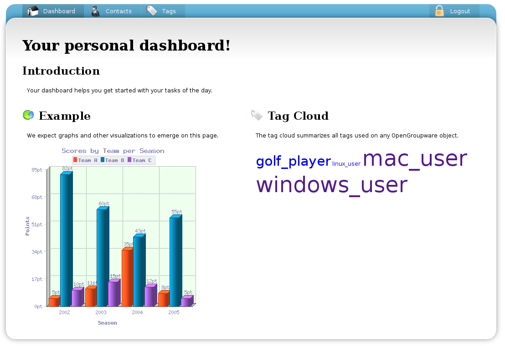
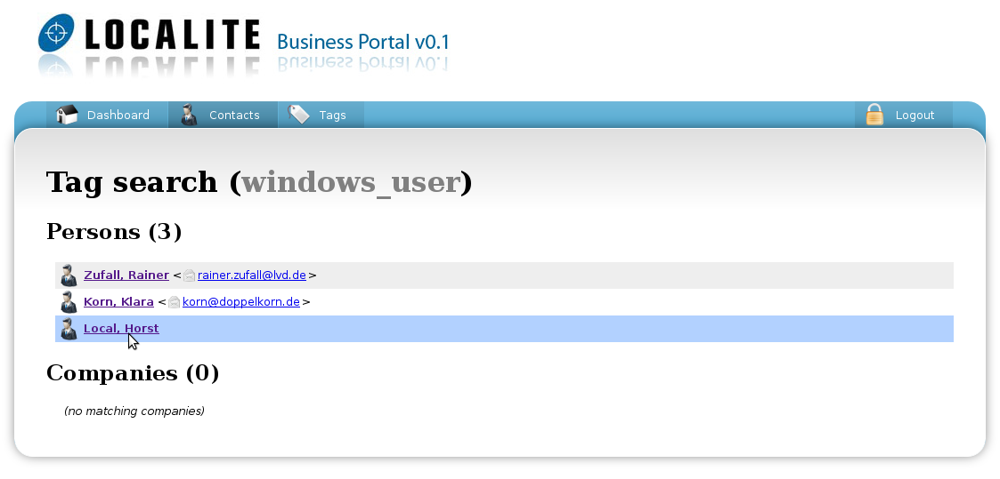
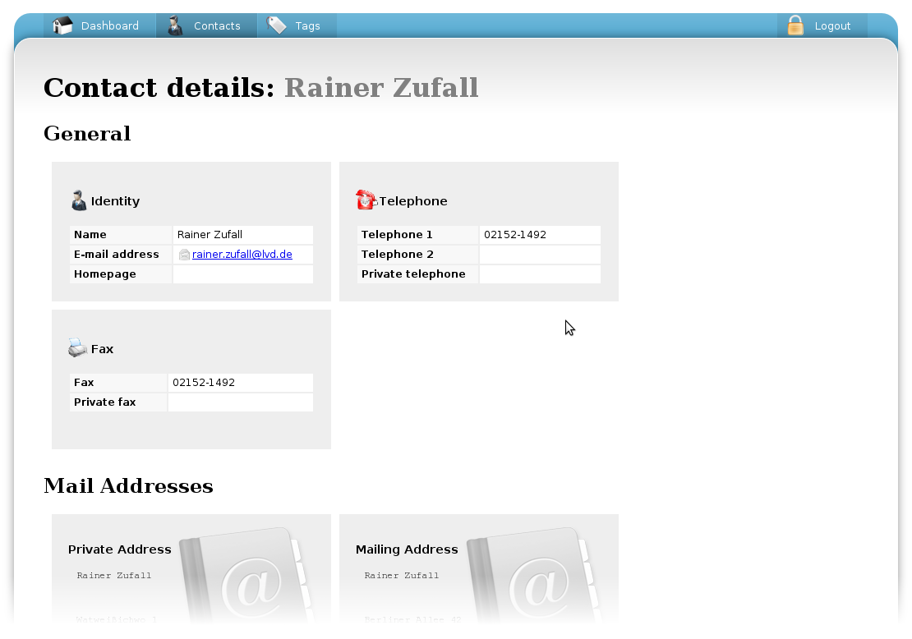

In our project, we were supposed to develop a CRM-application using *Grails*.
As a backend system we had to integrate *OpenGroupware*.
Maybe, I'm gonna post a more comprehensive article about the project soon.

The personal dashboard is the front page when signing in to the software:

You can tag contacts and companies and retrieve them afterwards:

Finally, this is how a contact page looks like:

I hope, you got a nice impression.
