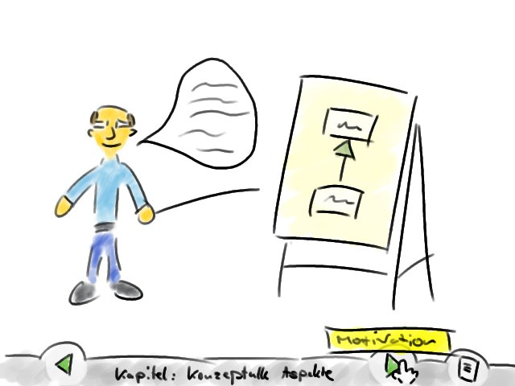
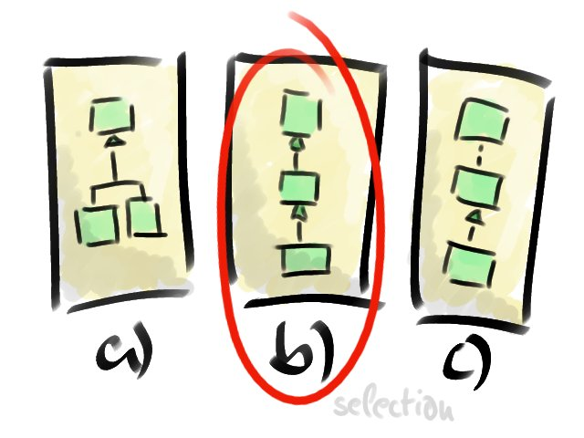

Our course project was develop a system for teaching students how to use polymorphism in object-oriented programming languages.
Our teams basic idea was to use cartoon characters with different roles which guide the student through the learning process.
Here is some graphical work I did for the prototype.

The learning was situated within a fictive company called *Software GmbH*:

An expert guides you through the technical content of the subject:

During the course the student can take tests to assess his performance:

I hope you liked the scetches.
They were developed with *GIMP* and *Wacom Bamboo*.
