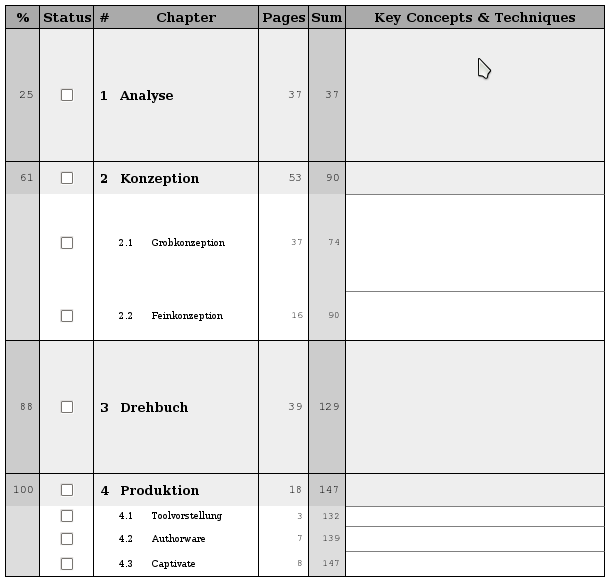
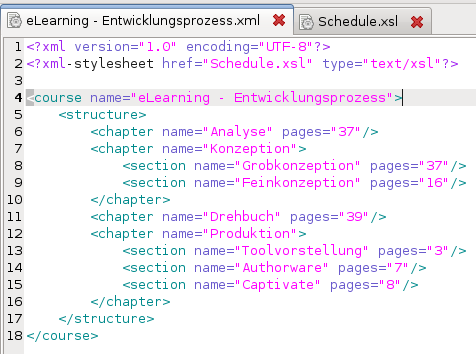
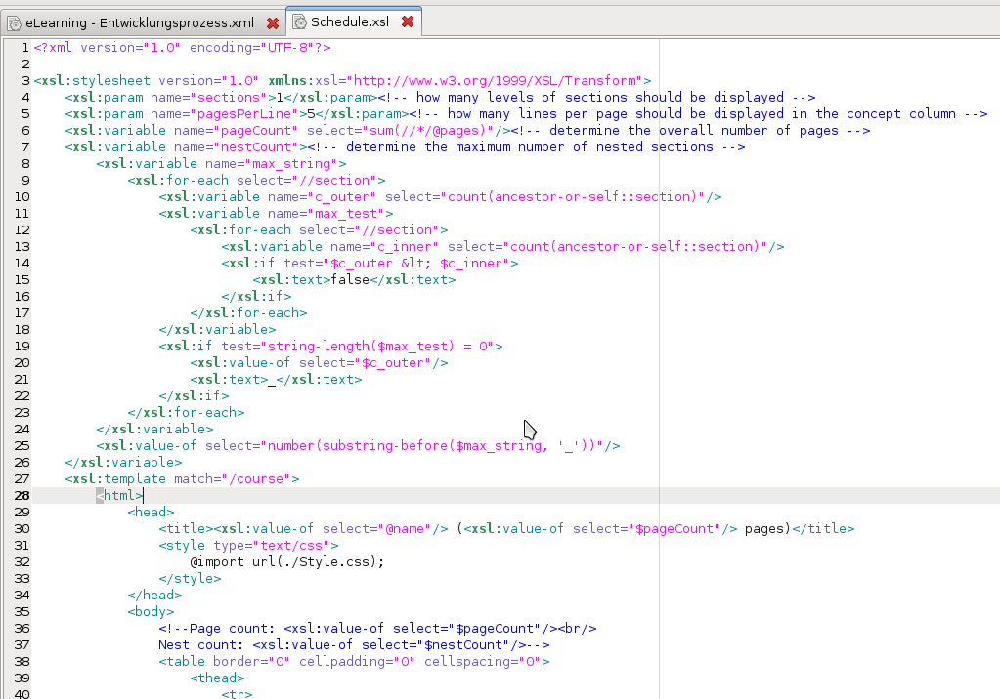

  
  The basic idea is, to have a table of the chapters, which have to be studied, their size and the overall percentage of progress after finishing it.
  In the picture to the right I have posted a schedule which I created for my *eLearning* exam last year.
  For this exam I had to study the production process for eLearning material.
  The production process is constituted of four main entities: the *analysis* where we have to find out what should be accomplished by introducing an eLearning system, the *conception* where we create an initial prototype for the system which can be verified by the customer, the *screenplay* which describes the eLearning system in its entire detail, and finally the *production* where the system is implemented for shipping.
  The plan provides me with the information of *how many slides* I have to read for each chapter.
  It also provides an accumulated view, i.e. the *sum over all preceeding chapters*.
  From this information we can calculate the *progress precentages*.
  The progress percentages help measuring and auditing your performance.
  Therefore, we also have a *status checkbox* to store your current progress.
  When finishing a chapter, I usually mark it as checked.
  Additionally, I write down the *key concepts and techniques*.
  They are meant to give a quick overview over the chapter's contents and guide you through the details.

After having designed these learning plans by hand for each course separately over the past years, I decided to implement and automation script.
The idea was to define the learning plan in *XML* and transform the information to a printable layout via *XSL*.
The language I used for specifying layouts is *HTML*.
Alternatively, one could use *XSL FO* having the advantage of being able to generate *PDF* files directly.
But *HTML* did the trick for now.

Here is now the *XML* code which was used for specifying the *eLearning* learn plan from above:

As you can see, I can specify the course and its structure in terms of *chapters* and *sections*.
For chapters and sections I can provide information about the number of pages.
These will be used for accumulation and percentage calculation.
Finally, I specify the *XML stylesheet* which has to be applied as a *XML processing instruction*.
This allows for opening the *XML* file in the browser directly and getting the layout displayed.

The stylesheet I cannot present in full length, as it covers around 150 lines of code.
Most of the code is responsible for generating correct percentage number in different cases.
Here is now a small excerpt:

What you should basically take from this code listing is, that an *HTML* document is generated on the fly.
For generating this document, I have to do mainly percentage calculations.
These have to be derived from accumulated sums and nested structures.
If you are interested in the full code, just ask me.
I can provide it later.

This was basically my technique for managing studies with a small tool chain which generates learning plans from *XML* descriptions.
I hope you liked the presentation.
Give me some feedback!
Maybe there are some nice ways to improve this idea!
