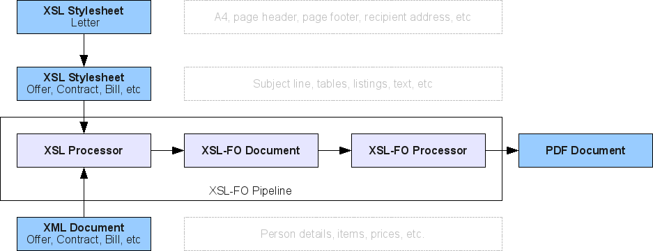

First, let's have a look what *XSL-FO* actually is:
XSL-FO is an XML-based language for type setting, i.e. for describing textual documents.
It is quite similar to HTML in specifying *margins* and *font properties*.
In a sense it is comparable to *Latex* as well because it is usually compiled into *PDF format* using a command line processor (though of course *Latex* is much more powerful especially because of its vast amount of styles and commands available).

If you want to know more about *XSL-FO* I refer you to the tutorial offer by [w3schools](http://www.w3schools.com/xslfo/default.asp).
That's at least where I learned how to use it.
Additionally, you should have a look at the *XSL-FO processor* offered by the [Apache Foundation](http://xmlgraphics.apache.org/fop/).
It provides an easy to use command line tool, which can be used to convert *XSL-FO documents* into *PDF format*.
Moreover, it not only provides direct XSL-FO input, but also normal XML plus an *XSL stylesheet*.
The *XSL stylesheet* is used to transform the original XML document into XSL-FO format.
That's also the final setup, I chose to use.
The following figure depicts the components graphically:

[](./system.png)

As input I provide an *XML document* which contains the data of the business document and the *XSL stylesheet* which takes care about the layout.
I'll demonstrate this setup using an example bill.

## Data Modeling: The XML Invoice Structure

The primary benefit of this architecture is the strict decoupling between structured business data and presentation layout.
The source XML document holds the invoice metadata, client address, and individual line items without any styling information:

```xml
<?xml version="1.0" encoding="UTF-8"?>
<bill>
  <about>
    <date>01.01.2010</date>
    <number>1</number>
    <service-period>
      <start-date>01.12.2009</start-date>
      <end-date>23.12.2009</end-date>
    </service-period>
  </about>
  <recipient>
    <person sex="female">
      <first-name>Berta</first-name>
      <last-name>Muster</last-name>
    </person>
    <address>
      <city country-sign="D" postal-code="YYYYY">Musterdorf</city>
      <street>Musterweg</street>
      <building-number>X</building-number>
    </address>
  </recipient>
  <entries>
    <entry>
      <identification>Beratung</identification>
      <quantity>1</quantity>
      <cost>50.00</cost>
    </entry>
    <entry>
      <identification>Umsetzung</identification>
      <quantity>1</quantity>
      <cost>100.00</cost>
    </entry>
  </entries>
</bill>
```

In the XML document we specify some meta-information such as the *date* and the *service period*.
Then we give information about the *recipient* and the *items*.
Notice, that this XML format is not standardized.
It suites very well my purpose, but can be changed according to personal preference.

## Master Template: Letter.xsl

To avoid duplicating corporate letterheads, margins, and sender information across different types of business documents (e.g., invoices, offers, delivery notes), we establish a shared base stylesheet `Letter.xsl`.

### Page Geometry and Regions

The master stylesheet sets up the physical A4 page dimensions, margins, and defines the header (`xsl-region-before`), body (`xsl-region-body`), and footer (`xsl-region-after`):

```xml
<fo:layout-master-set>
  <fo:simple-page-master master-name="A4-portrait" page-height="29.7cm" page-width="21.0cm" margin="2cm">
    <fo:region-body margin-top="1.5cm" margin-bottom="7.5cm"/>
    <fo:region-before extent="12pt"/>
    <fo:region-after extent="63pt"/>
  </fo:simple-page-master>
</fo:layout-master-set>
```

### Static Header and Footer Blocks

The header and footer are placed inside `fo:static-content` containers, ensuring they repeat across all pages. The footer includes structured contact details and bank connection data positioned with absolute side-by-side containers:

```xml
<fo:static-content flow-name="xsl-region-after">
  <fo:block-container line-height="1.4" font-size="8pt" border-before-style="solid" border-before-color="black" border-before-width="1pt">
    <fo:block-container>
      <fo:block font-weight="bold" space-after="3pt" margin-top="3pt">Kontaktperson</fo:block>
      <fo:block>Name: Hans Muster</fo:block>
      <fo:block>Mobil: +49 (xxx) yyy yyy yy yy</fo:block>
      <fo:block>E-Mail: kontakt@hans-muster.de</fo:block>
    </fo:block-container>
    <fo:block-container position="absolute" left="8.5cm" top="0cm" text-align="end">
      <fo:block font-weight="bold" space-after="3pt" margin-top="3pt">Bankverbindung</fo:block>
      <fo:block>Kontoinhaber: Hans Muster</fo:block>
      <fo:block>Kontonummer: xxx xxx xx</fo:block>
      <fo:block>Bankleitzahl: yyy yyy yy</fo:block>
    </fo:block-container>
  </fo:block-container>
</fo:static-content>
```

### Dynamic Recipient Addressing

The recipient template extracts the dynamic customer data passed into the stylesheet, applying conditional salutations based on gender attributes:

```xml
<xsl:template name="recipient">
  <fo:block font-size="7pt" text-decoration="underline" padding-after="7pt">Hans Muster, Musterstrasse XX, YYYYY Musterstadt</fo:block>
  <fo:block>
    <xsl:choose>
      <xsl:when test="$recipient/person/@sex = 'female'">Frau </xsl:when>
      <xsl:when test="$recipient/person/@sex = 'male'">Herr </xsl:when>
    </xsl:choose>
    <xsl:value-of select="$recipient/person/first-name"/>
    <xsl:text> </xsl:text>
    <xsl:value-of select="$recipient/person/last-name"/>
  </fo:block>
  <fo:block>
    <xsl:value-of select="$recipient/address/street"/>
    <xsl:text> </xsl:text>
    <xsl:value-of select="$recipient/address/building-number"/>
  </fo:block>
  <fo:block>
    <xsl:value-of select="$recipient/address/city/@country-sign"/>-<xsl:value-of select="$recipient/address/city/@postal-code"/>
    <xsl:text> </xsl:text>
    <xsl:value-of select="$recipient/address/city"/>
  </fo:block>
</xsl:template>
```

## Invoice Transformation: Bill.xsl

Now, we define the concrete invoice template `Bill.xsl`. It inherits the master letterhead layout while focusing purely on bill-specific components.

### Template Import and Parameter Binding

The invoice stylesheet begins by importing `Letter.xsl` and binding the document's `<recipient>` node to the parameter expected by the parent template:

```xml
<xsl:stylesheet version="1.0" xmlns:xsl="http://www.w3.org/1999/XSL/Transform" xmlns:fo="http://www.w3.org/1999/XSL/Format">
  <xsl:import href="Letter.xsl"/>
  <xsl:param name="recipient" select="/bill/recipient"/>
  <xsl:decimal-format name="euro" decimal-separator="," grouping-separator="."/>
```

### Invoice Metadata Header

Inside the main `<xsl:template match="/bill">`, we render the invoice title, invoice number, issue date, and service period into a clean two-column metadata block:

```xml
<fo:block-container space-after="30pt">
  <fo:block-container position="absolute" left="11.4cm" top="0cm" font-size="8pt">
    <fo:block>Rechnungsnummer: <xsl:value-of select="about/number"/></fo:block>
    <fo:block>Rechnungsdatum: <xsl:value-of select="about/date"/></fo:block>
    <fo:block>Leistungszeitraum: <xsl:value-of select="about/service-period/start-date"/> - <xsl:value-of select="about/service-period/end-date"/></fo:block>
  </fo:block-container>
  <fo:block line-height="18pt" font-size="18pt" font-weight="bold" space-before="15.6pt">Rechnung</fo:block>
</fo:block-container>
```

### Dynamic Items Table with Alternating Row Colors

To display the invoiced positions clearly, we build an `fo:table` with proportional column widths and alternate the background color of each table row using the modulo operator `position() mod 2`:

```xml
<fo:table table-layout="fixed" width="100%" space-before="9pt" space-after="9pt">
  <fo:table-column column-width="proportional-column-width(1)"/>
  <fo:table-column column-width="proportional-column-width(7)"/>
  <fo:table-column column-width="proportional-column-width(2)"/>
  <fo:table-column column-width="proportional-column-width(3)"/>
  <fo:table-column column-width="proportional-column-width(2)"/>

  <fo:table-body>
    <xsl:for-each select="entries/entry">
      <xsl:variable name="color">
        <xsl:choose>
          <xsl:when test="position() mod 2">#e0e0e0</xsl:when>
          <xsl:otherwise>white</xsl:otherwise>
        </xsl:choose>
      </xsl:variable>
      <fo:table-row background-color="{$color}">
        <fo:table-cell padding="5pt"><fo:block text-align="center"><xsl:value-of select="position()"/></fo:block></fo:table-cell>
        <fo:table-cell padding="5pt"><fo:block><xsl:value-of select="identification"/></fo:block></fo:table-cell>
        <fo:table-cell padding="5pt"><fo:block text-align="end"><xsl:value-of select="quantity"/>x</fo:block></fo:table-cell>
        <fo:table-cell padding="5pt"><fo:block text-align="end"><xsl:value-of select="format-number(number(cost), '##.###,00', 'euro')"/></fo:block></fo:table-cell>
        <fo:table-cell padding="5pt"><fo:block text-align="end"><xsl:value-of select="format-number(number(quantity*cost), '##.###,00', 'euro')"/></fo:block></fo:table-cell>
      </fo:table-row>
    </xsl:for-each>
  </fo:table-body>
</fo:table>
```

### Recursive Total Cost Calculation

Because XSLT 1.0 is a purely functional transformation language without mutable accumulator variables, computing the invoice grand total requires a recursive template that traverses sibling nodes (`following-sibling::entry`):

```xml
<xsl:template name="sum">
  <xsl:param name="partial">0</xsl:param>
  <xsl:param name="item" select="entries/entry[position() = 1]"/>

  <!-- Accumulate costs of current item -->
  <xsl:variable name="updated" select="$partial + number($item/quantity) * number($item/cost)"/>

  <xsl:choose>
    <xsl:when test="$item/following-sibling::entry">
      <!-- Recursive call for remaining entries -->
      <xsl:call-template name="sum">
        <xsl:with-param name="partial" select="$updated"/>
        <xsl:with-param name="item" select="$item/following-sibling::entry"/>
      </xsl:call-template>
    </xsl:when>
    <xsl:otherwise>
      <!-- Return formatted grand total -->
      <xsl:value-of select="format-number($updated, '##.###,00', 'euro')"/>
    </xsl:otherwise>
  </xsl:choose>
</xsl:template>
```

## Summary and Lessons Learned

Developing business documents using XML and XSL-FO provides a clean, robust separation between business data and layout.
By isolating corporate letterhead definitions in `Letter.xsl` and document-specific structures in `Bill.xsl`, new document types can be introduced rapidly.

While Apache FOP provides an effective automated pipeline for document generation, integrating complex vector graphics can occasionally pose challenges. For highly mathematical or typesetting-heavy requirements, generating LaTeX source from XML is a powerful alternative, while XSL-FO remains an excellent solution for standard corporate business workflows.

*Historical Archive (2009–2017):* [← Previous: XML-RPC based Spam Filtering.](/posts/2009_03_20_xml_rpc_based_spam_filtering/) | [Next: Augmented Reality Framework Screenshot. →](/posts/2009_03_24_augmented_reality_framework_screenshots/)
