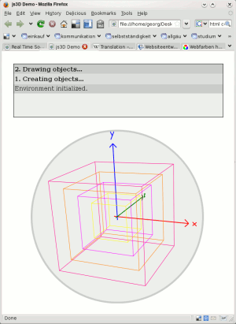
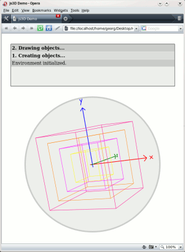

I tested the system on different browsers.
Sadly, Internet Explorer does not provide native SVG support.
But with the new HTML 5 standard things might change due to the *canvas* element.
Here are sample screenshots from Firefox and Opera browsers (note that other browsers such as Microsoft Internet Explorer, Safari, and Opera are supported in principle as well):

In this example real-time rotation was realized.
Maybe, in a more comprehensive article I will present the techniques and some performance evaluations.
