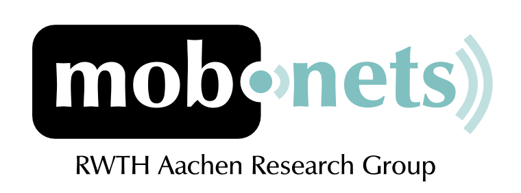

The logos are developed using open source software such as [Gimp](http://www.gimp.org) and [Inkscape](http://www.inkscape.org).
For some I used my *Wacom Bamboo* which is a great tool for drafting and creative work.

The first logo was for a chair at the *RWTH Aachen* called *Mobnets*.
They are concerned with mobile and wireless technologies.

The next logo I developed during my traineeship at [Siemens Corporate Research](http://www.scr.siemens.com).
It was intended to be used for a collaboration platform in medical research.

The next logo I sketched for a small project of mine called *RIDE*.
As soon as I have something good to demonstrate, I will post an entire article on the project.

Finally, here's a very first draft about another idea with the name *edu ride*.
I created it during a branding brainstorming session.

What I've learned during my work is that sketching with *Wacom Bamboo* and implementation with vector graphics works best for me.
Also the mentioned open source tools are really sufficient, to implement most of my ideas.
The only drawback I experienced was stability of *Inkscape*, but that was some time ago and should be fixed now.

I hope you liked the impressions. Give me some feedback if you like. Have a nice day!

*Historical Archive (2009–2017):* [← Previous: JavaScript 3D Engine Screenshots.](/posts/2009_03_24_js_3d_engine_screenshots/) | [Next: HyperKit - A lightweight CMS written in PHP. →](/posts/2009_05_30_hyperkit_leightweight_cms_php/)
