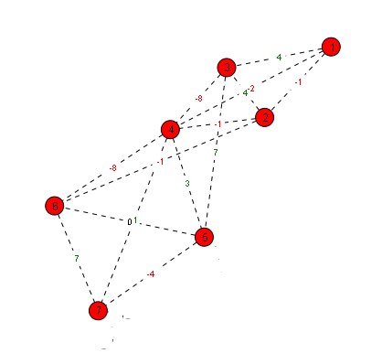

The current prototype is restricted to use with SVG-enabled browsers such as *Mozilla Firefox* or *Opera*.
I decided to use SVG to draw circles and lines which provides a much richer visual presentation of graphs.
The original prototype used HTML `div` elements and didn't draw edges between the nodes.
The following picture is an example graph rendered with the engine:

[](./svg.png)

The nodes are represented as red circles.
Each node is identified by a numbered label.
Edges are drawn as dashed lines.
The numbers on the edges represent the deviation of the edge length from the optimal edge length.
The optimal edge length can be defined by the user.
This way, the user can specify, how much the graph structure is extended or contracted.

Now, let's have a look, how the graph is specified in the backend.
Currently, there is a simple functional API for creating and linking nodes as well as starting the layout algorithm.

### Graph Definition and Topology Setup

Nodes are instantiated as SVG circles, and links are established with target optimal distances:

```javascript
// Create 7 graph nodes
for (var i = 0; i < 7; i++) {
  createNode();
}

// Connect nodes with target edge lengths
linkNodes(0, 1, 430 / 4);
linkNodes(0, 2, 450 / 4);
linkNodes(0, 3, 800 / 4);
linkNodes(1, 2, 260 / 4);
linkNodes(1, 3, 420 / 4);
linkNodes(1, 5, 1000 / 4);
linkNodes(2, 3, 400 / 4);
linkNodes(2, 4, 720 / 4);
linkNodes(3, 4, 480 / 4);
linkNodes(3, 5, 640 / 4);
linkNodes(3, 6, 850 / 4);
linkNodes(4, 5, 670 / 4);
linkNodes(4, 6, 580 / 4);
linkNodes(5, 6, 470 / 4);

startAlgorithm();
```

The calls to the method `createNode` add a node item to the internal data structures and return a node identifier.
The calls to the method `linkNodes` add edges to the internal data structures for the two nodes specified in the first two arguments.
The third argument is the optimal edge length, allowing the user to specify how much the graph structure extends or contracts.

## Force-Directed Layout Implementation

The layout engine uses spring-electrical force dynamics to iteratively move nodes toward their equilibrium states.

### Simulation Configuration

The engine configures damping, step sizes, and canvas boundaries:

```javascript
var stepsize = 0.25;       // Percentage of the force sum applied per step
var randomsize = 0;         // Random perturbation size in pixels
var width = 800;            // Width of the SVG canvas
var height = 600;           // Height of the SVG canvas
var move_threshold = 1;     // Percentage of nodes active per step
var edge_threshold = 1;     // Percentage of edges evaluated per step
```

### Accumulating Spring Forces

In each iteration, the engine computes the distance vector between linked nodes and accumulates attraction or repulsion forces based on deviations from the target edge length:

```javascript
for (var j = 0; j < nodes.length; j++) {
  if (Math.random() < edge_threshold && weights[i] && weights[i][j]) {
    var diffx = posx[j] - posx[i];
    var diffy = posy[j] - posy[i];
    var distance = Math.sqrt(diffx * diffx + diffy * diffy);
    var length = distance - weights[i][j];

    // Accumulate directional force vector
    updatex[i] += (length * diffx) / distance;
    updatey[i] += (length * diffy) / distance;
  }
}
```

### Updating Node Positions and SVG Coordinates

Finally, the displacement vectors are damped by `stepsize` and applied directly to the SVG circle elements:

```javascript
for (var i = 0; i < nodes.length; i++) {
  posx[i] += updatex[i] * stepsize + ((Math.random() - 0.5) * factors[i]);
  posy[i] += updatey[i] * stepsize + ((Math.random() - 0.5) * factors[i]);

  // Synchronize SVG DOM attributes
  nodes[i].setAttribute("cx", posx[i] + "px");
  nodes[i].setAttribute("cy", posy[i] + "px");
}

iteration_step++;
updateMetaData();
```

Soon, I plan to extend this framework for non-SVG enabled browsers.
Also the API needs some refactoring.
An object-oriented design might be more suited, to even support multiple graphs on a single page and simple AJAX support.

I hope you like the idea for this toolkit.
Give me some feedback!

*Historical Archive (2009–2017):* [← Previous: HyperKit - A lightweight CMS written in PHP.](/posts/2009_05_30_hyperkit_leightweight_cms_php/) | [Next: Algorithm Debugging using OpenGL. →](/posts/2009_07_21_opengl_debugging_grid_3d/)
