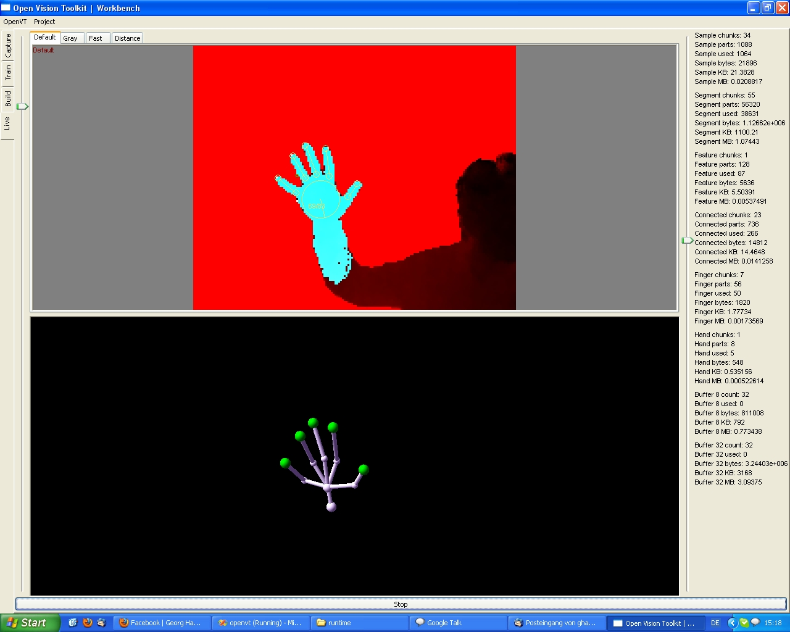
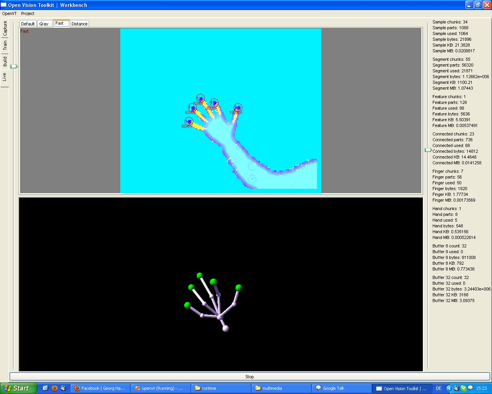

I have prepared two screenshots for you, both showing the live view of my *visual workbench* application.
The live view directly processes the video stream delivered by the USB camera, calculates the hand position and draws the results.
I use [wxWidgets](http://www.wxwidgets.org) and [OpenCV](http://opencv.willowgarage.com/) as third-party, open source dependencies.

The first screenshot shows the *default view* (on the top of the screen), the *skeleton view* (on the bottom of the screen) and the *memory statistics view* (on the right of the screen).

In the second screenshot, the *default view* is replaced by the *fast view*.
Read the paper to understand the difference `;)`.

I hope you enjoyed the demonstration.
Stay tuned for new results in the coming months!
E.g. we are building a 3D web browser prototype for evaluating gestural interaction.
