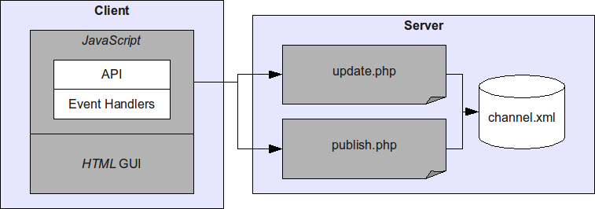

The solution for user synchronization and event propagation is a so-called distributed event bus.
The idea of this bus is, to provide a component where several clients can connect for publishing and recieving events.
The component guarantees that any event propagated will also be recieved by all clients interested.
Similar techniques have already been used for implementing Google's [GMail](http://mail.google.com) and [Wave](http://wave.google.com) applications.
These use the distributed event bus for notifying the user of new emails, chats and much more.

To get started with my simple prototype, I posted a video on [YouTube](http://www.youtube.com) which demonstrates the basic capabilities of the system.
In the demo, I use two browsers for accessing the distributed event bus.
This simulates the use case where two independent clients log in from possibly varying locations.

<iframe title="YouTube video player" src="//www.youtube.com/embed/q4Ay6ZP5cqQ?rel=0" frameborder="0" allowfullscreen="yes"></iframe>

Now, let's understand how the implementation of this simple prototype works.
Therefore, I prepared a figure illustrating the architectural structure of the system.
The main decompostion is done by *client* and *server*, each refering to the web browser and the web server respectively.
Both comunicate via the *HTTP* protocol, which is the standard protocol for web content retrieval.
This protocol is also used by *AJAX* for reloading page fragments from the server or uploading content from the client without the need of reloading the entire page.
Finally, for each entity the individual subcomponents are depicted which I will discuss later.

[](./architecture.png)

Now, let's have a look at each subcomponent in isolation.
From this presentation I hope to give the best possible insight into the system.
If you have further questions, do not hesitate to send me a message or comment on this article.
The **channel** is the heart of the system.
It is stored on the server and basically denotes a regular XML file storing all events in a circular log file fashion.
*Circular log file* means, that only a maximum number of entries is stored.
If this limit is reached, the oldest entries are being deleted saving space for new ones.
This is an effective method for saving hard disk memory on your system which is also used by many other applications and software packages like *DB2*.
The format of the log file is defined as follows:

```xml
<channel>
  <item timestamp="1262600000" microseconds="0.1234" client="123456" type="message">
    <content>Hello World!</content>
  </item>
</channel>
```

At its root, a `channel` element is defined which holds a possibly infinite number of `item` elements.
The items store the actual events that have occured during system operation.
Each item provides information about the time, client, type and content of the event.
The time is given in timestamp format, i.e. the elapsed number of seconds since January 1, 1970.
The client currently stores a randomly generated ID, which is assigned to each web browser instance upon page entrance.
The event type and content are arbitrary, i.e. they can be tailored to any specific need like transmitting login events, keypress events or higher level activities.

The other two server-side components are the **publish** and **update** script.
The first takes care of inserting new `item` elements into the channel.
The event information is passed using *HTTP GET* and *HTTP POST* requests.
The second takes care of retrieving updated event information from the channel.
Therefore, the last timestamp seen by the client is passed as an *HTTP GET* parameter.
Each more recent item is delivered by the script in the same format as defined by the **channel** data structure.
For concurrency reasons, both scripts first acquire a lock for the file before reading or writing its contents.
This simple filesystem based synchronization method works well in the PHP domain.

Finally, the client-side components are left for discussion.
The core of the client deployment is a general *JavaScript API* which allows to connect to channels, register event handlers and publish events.

### Event Dispatching and Publishing

Every browser instance generates a random client ID upon entry. When an event is dispatched or published, HTTP POST sends the payload to `post.php`:

```javascript
var client = Math.round(Math.random() * 1000000);
var handlers = new Object();

function HandleEvent(timestamp, microseconds, client, type, content) {
  if (handlers[type]) {
    for (var i = 0; i < handlers[type].length; i++) {
      handlers[type][i](timestamp, microseconds, client, type, content);
    }
  }
}

function Publish(type, content) {
  var body = "client=" + client + "&type=" + encodeURIComponent(type) + "&content=" + encodeURIComponent(content);
  var post = new XMLHttpRequest();
  post.open("POST", "post.php");
  post.setRequestHeader("Content-type", "application/x-www-form-urlencoded");
  post.send(body);
}
```

### Long-Polling Connection Loop

The `Connect` function initiates long-polling against `channel.php`. As soon as the server closes the response stream after a timeout or new events, it recursively reconnects using the latest timestamps:

```javascript
function Connect(timestamp, microseconds) {
  var channel = new XMLHttpRequest();
  channel.onreadystatechange = function() {
    if (channel.readyState == 4) {
      Update(channel.responseText);
      Connect(last_timestamp, last_microseconds);
    }
  };
  channel.open("GET", "channel.php?timestamp=" + timestamp + "&microseconds=" + microseconds);
  channel.send(null);
}
```

### Event Handler Registry

Clients register callbacks for distinct event types without coupling components together:

```javascript
function Register(type, handler) {
  if (!handlers[type]) {
    handlers[type] = new Array();
  }
  handlers[type].push(handler);
}

function Unregister(type, handler) {
  if (handlers[type]) {
    var index = handlers[type].indexOf(handler);
    if (index != -1) {
      handlers[type].splice(index, 1);
    }
  }
}
```

## Client Application Example

To demonstrate the API, we wire an HTML chat interface to the distributed event bus:

```javascript
function Say(form) {
  Publish("message", form.content.value);
  form.content.value = "";
}

function UpdateMessageList(timestamp, microseconds, client, type, content) {
  var messageList = document.getElementById("messages");
  var messageItem = document.createElement("li");
  messageItem.appendChild(document.createTextNode(content));
  messageList.appendChild(messageItem);
}

Register("message", UpdateMessageList);
Connect(timestamp, microseconds);
```

First, the method `Say` publishes an event of type `message` from the form input.
Next, the `UpdateMessageList` event handler is registered with the event bus. When any client sends a message, all connected clients receive the notification and append it to their UI.

## Server-Side Implementation

The backend is driven by two lightweight PHP scripts that manage the file-based circular queue with filesystem locks.

### Long-Polling Event Consumer (channel.php)

The consumer script holds open an HTTP connection for up to 25 seconds, querying `channel.xml` with a shared read lock (`LOCK_SH`):

```php
<?php
header("Cache-Control: no-cache, must-revalidate");
header("Content-Type: text/xml");

$lock = fopen("access.lock", "r");
$timestamp = (int) $_GET['timestamp'];
$microseconds = (float) $_GET['microseconds'];

$start = time();
while (time() - $start < 25) {
  while (!flock($lock, LOCK_SH)) {
    // Wait for shared read lock
  }
  $channel = simplexml_load_file("channel.xml");
  while (!flock($lock, LOCK_UN)) {
    // Release read lock
  }

  foreach ($channel->item as $item) {
    if ((int) $item['timestamp'] > $timestamp) {
      print($item->asXML());
      flush();
      $timestamp = (int) $item['timestamp'];
    }
  }
  usleep(20000);
}
?>
```

### Event Ingestion & Circular Queue Pruning (post.php)

When a client submits an event, `post.php` acquires an exclusive lock (`LOCK_EX`), appends the new `<item>`, and automatically removes items older than 10 seconds to maintain a fixed file size:

```php
<?php
$lock = fopen("access.lock", "r");
while (!flock($lock, LOCK_EX)) {
  // Wait for exclusive write lock
}

$channel = simplexml_load_file("channel.xml");
$item = $channel->addChild("item");
$item['timestamp'] = time();
$item['client'] = $_POST['client'];
$item['type'] = $_POST['type'];
$item->content = $_POST['content'];

$dom = dom_import_simplexml($channel);
foreach ($channel->item as $entry) {
  if ((int) $entry['timestamp'] < time() - 10) {
    // Evict items older than 10 seconds
    $dom->removeChild($dom->firstChild);
  } else {
    break;
  }
}

$dom->ownerDocument->save("channel.xml");
while (!flock($lock, LOCK_UN)) {
  // Release write lock
}
?>
```

I hope you enjoyed the demonstration of this sweet little piece of technology.
If you have further questions or want to play with the code, just drop me a line.


