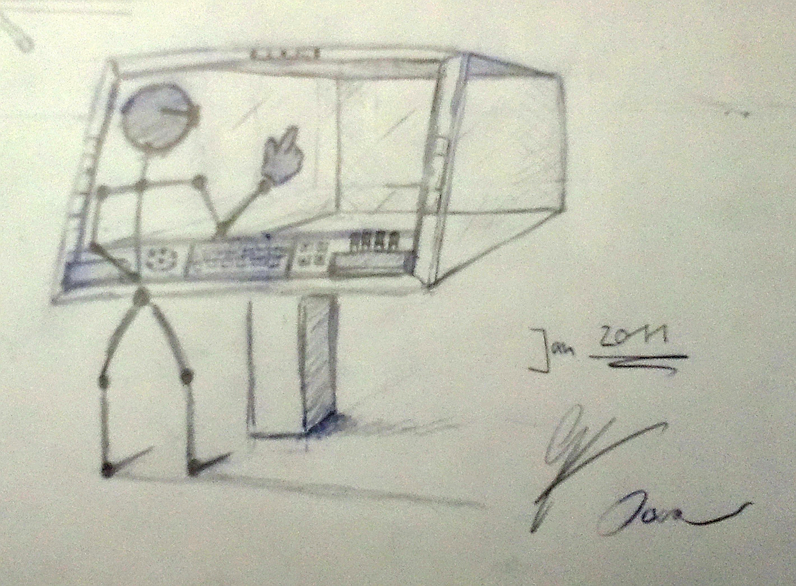

All in all the setting is inspired by Osca's profession: **Drawing**.
However, we not only had *artistic* but also *technical drawings* in mind, i.e. a mixture of Photoshop style and CAD style applications.
Thereby, we see major benefits of a digital drawing table in:
(1) the flexibility of a digital system,
(2) the integration with world-wide networks,
and (3) the potential for usability improvements due to 3D interaction around large high-resolution screens.
Moreover, the screen surface could also serve as a light talbe (commonly used for animations) and as a regular paper drawing table.

Current elements of the digital drawing table are:
(1) a 3D LED TV, which allows to deliver true 3D impressions of digital content and media.
(2) a tool and control panel on the bottom of the digital drawing surface, which provides access to generic and application-dependent widgets and pens.
(3) a set of cameras mounted on the edges of the digital drawing surface, which cover the interaction space and track user movements.
(4) a handling similar to paper-based counterparts as for example producted by [Bieffe](http://www.bieffe.it).

How far we can go with that vision time will show.
But I truely believe that future work spaces in many professions will have similarly complex digital high-tech components due to their Cameleon-abilities and networked integration with society.

At last it is left to say that if you like the idea and you are interested in contributing do not hesitate to contact me!
Brilliant tools are always a product of social interaction in many ways!
