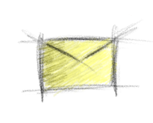
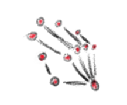

It all started with drafting new versions of the RSS and mail logos, which can be found on the header of my blog:

Next a talk came into my mind when I was explaining a friend of mine the software architecture of my master thesis.
In this talk I used a similar visualization than the following to highlight the components:

While searching for further inspiration I picked random objects from my environment and imagination for the following to drawings:

And finally I drew my attention onto the visualization of humans respectively activities, which is useful during the development and marketing of many software systems:

Note that these are all digital drawings! Isn't that amazing?!

For the future I hope to create many more of these visualizations to share my ideas on informatics, computer science, and software development.
Maybe this naive and visual way of explanation is both interesting and entertaining even for a non-technical audience - very much as the photographies of outer space in the domain of physics/astronomy.
