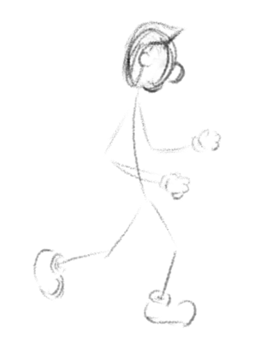
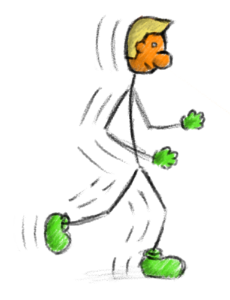

The book suggests to start with a quick sketch of the figure.
This way you give your brain minimal chance to disrupt the creative process by starting to think about good and bad.
Then when you are satisfied with the result you can start elaborating your drawing with thicker and stronger lines.
To give your picture the final touch you finally can add colors and shading as well as motion effects.

The main two stages (drafting and elaborating) are shown in the following images:

As tools I used a tablet PC and the open source software [MyPaint](http://mypaint.intilinux.com/).
This digital drawing toolset greatly facilitates the creative process:
(1) You can develop the draft quickly in the lowest layer of your canvas.
(2) You can add arbitrarily many virtual layers on top to elaborate the remaining parts of the picture.

I hope you like to follow my experiences with creative tools and processes.
It's great fun and I can only recommend it to anybody who is looking for ways to see the world with different eyes.
