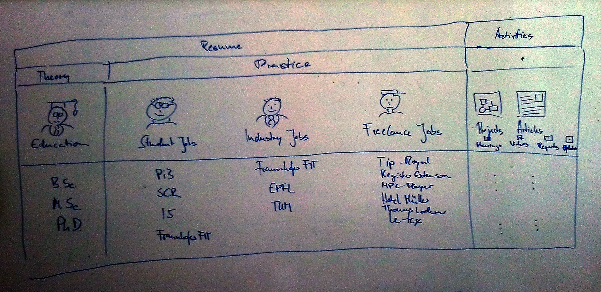
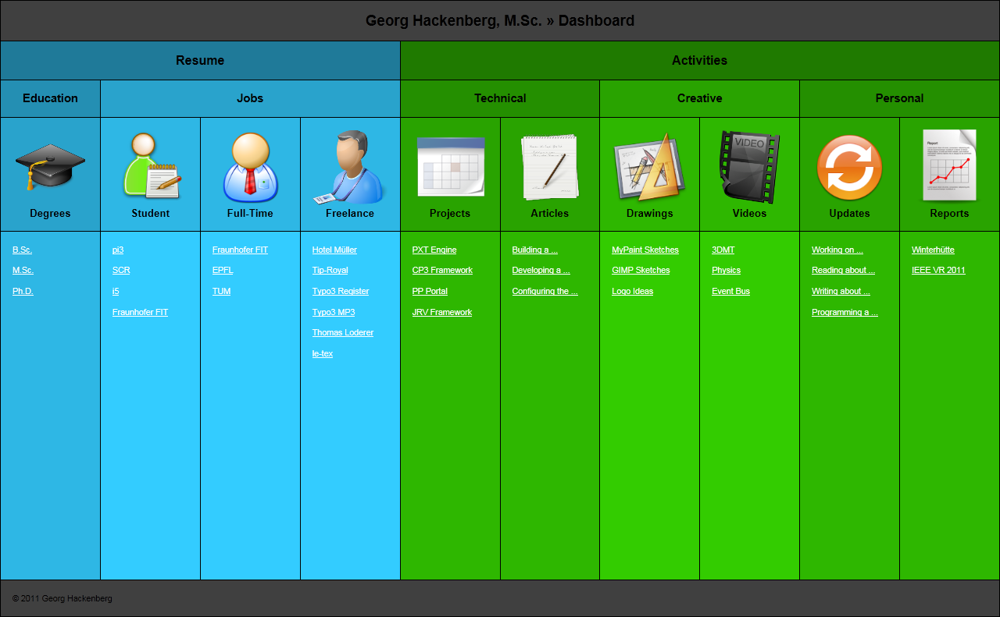
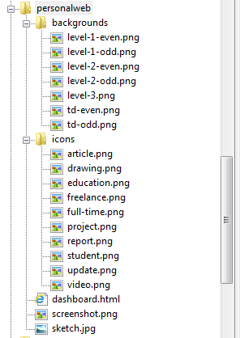
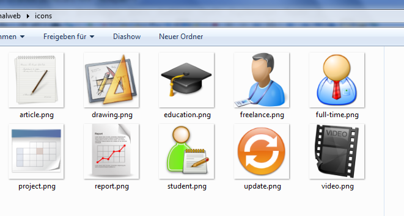
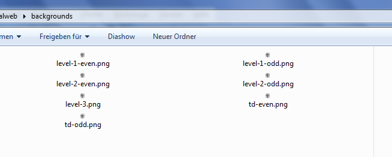
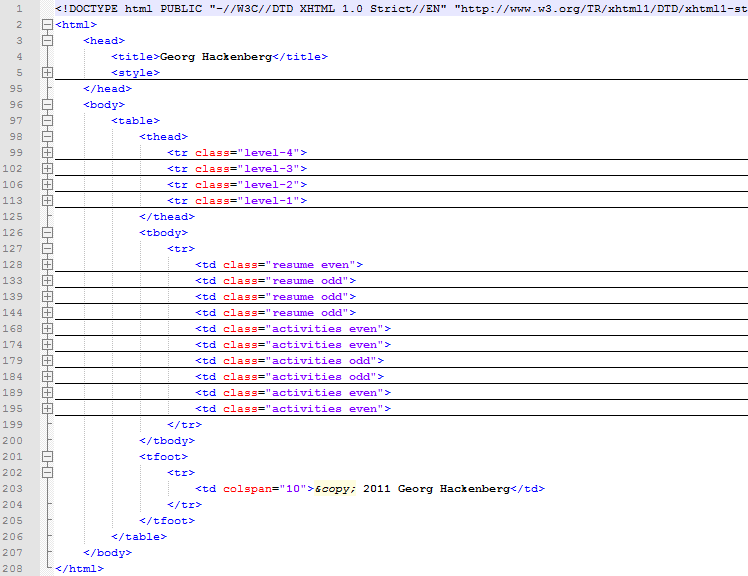
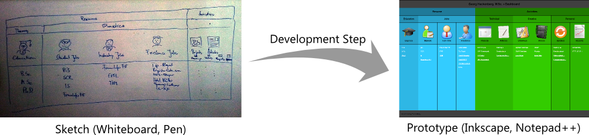

Fundamental to any good interface design is to understand the contents and information that will be accessed through the software application.
Though not being part of this article I have been working on understanding my portfolio in terms of the underlying data structure.
What I came up with was (1) my resume structured into (a) my education and (b) my jobs and (2) my activities structured into (a) technical, (b) creative, and (c) personal content.
This information served as the input for a whiteboard sketch, where I tried to illustrate and organize the items in a plane.

You can see that the resume part of the the information structure is already worked out quite well.
However, the activities greatly lack detail, which is due to the size of my whiteboard.
Still, the general concept was clear: The information is organized in a table, each column is labeled with an icon plus text, and the columns are further grouped into different levels of categories (theory/practice, resume/activities, ...).
This information was already enough to take the next step and build a software prototype from it.
I chose to use HTML/CSS and PNG images for this step, (1) for my knowledge of these tools and (2) for their high flexibility.

As you can see the table layout idea is reflected one-to-one.
What has been added are (1) the colors for visually separating the main groups *resume* and *activities*, (2) the horizontal color shades for separating the second level groups *education/jobs* and *technical/creative/personal*, and (3) the vertical color shades for separating the level of detail (e.g. resume/education/degrees/B.Sc.,M.Sc.,Ph.D.).
The icons I have searched and downloaded via Google images and serve as placeholder for custom material later in the process.

Finally, here is some technical information about the prototype and its realization in HTML.
The files are organized into `icons`, `backgounds`, and the `dashboard.html` file.
The `icons` folder contains the transparent PNG icons downloaded form Google images.
The `backgrounds` folder contains semi-transparent black 1-pixel PNG images which are used as the different vertical and horizontal cell shades explained previously.
Finally, the `dashboard.html` file contains the implementation of the prototype in HTML/CSS.

The purpose of this article was to explain the process how to get from a sketch to a prototype of your software application.
These types of processes are very common in software development.
Usually, you get some sort of fuzzy input (in this case the whiteboard sketch) and transform it into a more precise representation (the HTML code).
I hope you found it interesting to see this evolution happen to a concrete example.
In the future I hope to find similar stories to tell, as it is also an interesting process for me.

All the best.
