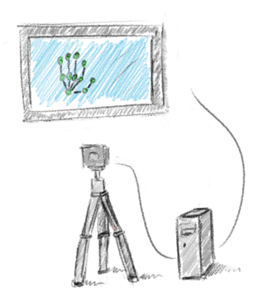
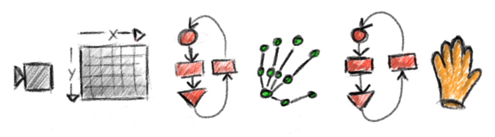
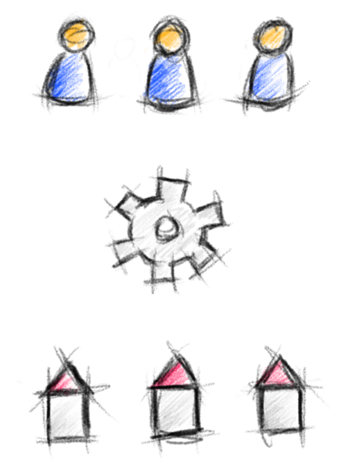

We start with illustrations that are close to the real-world and move to more abstract representations of interesting system aspects.

The previous pictures illustrates the hardware components needed for running the [3D Multi-Touch Prototype](/article/2010_06_27_master_thesis_video/index.html) I developed during my Master thesis at *Fraunhofer FIT*.
This type of illustration should be easy to understand as it shows real-world objects (tripod, camera, PC, flat-screen) and their connectivity (USB cable between camera and PC, HDMI cable between PC and flat-screen).
What the picture does not say is what type of software is running on the PC for getting the hand skeleton on screen.
For this purpose I created the following illustration.

This second picture illustrates the process how to get from the camera image to a classified hand gesture.
Here a certain flow of information and control is in the center of our observation.
To support this point of view the items are arranged sequentially as opposed to the previous picture, where a spacial arrangement was used instead.

The last picture is a rather incomplete illustration of the system architecture of a [Web Crawler Engine](http://www.hyperkit-software.com/projects/webcrawler/index.html) I developed to collect information about real estate offers in a certain region.
Here the idea is to show the role of the crawler engine (the gear) as a mediator between the users (human icons) and the real estate websites (house icons).
Again this gives a completely different understanding of software systems as opposed to the previous two illustrations.

I hope this post gave you an idea of the huge variety of illustrations that can be created for software systems, what information they carry (hardware components, process components, stakeholders, etc), and what principles guide the layout of this information (spacial, sequential, network, etc).
A clear understanding of the visualization problem and practical solutions will help making the IT world more accessible to the individuals of our society, resulting in a better interface between IT solution customers and providers.
