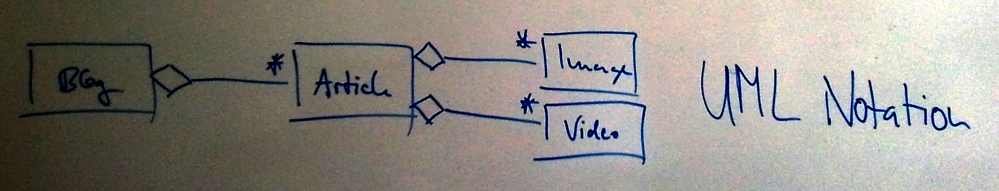
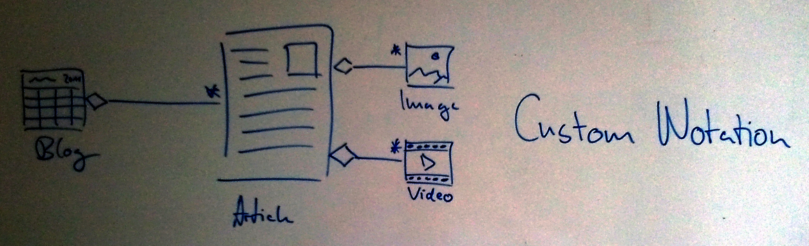

Consider the case of a blog, where articles are organized by date.
Further, the articles my contain any number of images and videos.
In particular, this information structure serves as the foundation of this website.
Now, in UML this structure would be visualized as follows.
`Blog`, `Article`, `Image` and `Video` are the basic information blocks each depicted by a box.
The lines between the boxes define the associations of the information, e.g. an article my contain several images respectively videos, where a blog may contain several articles.
The `*` (star) sign indicates the number of admissable instances of the particular information block, e.g. a blog may contain any number of articles and an artcile may contain any number of images/videos.

Now compare the above visualization to the following variation, where more figurative illustrations of the information blocks are provided.
Again, the same notation is used to describe the associations between the blocks.
However, the blocks themselves are depicted by content-specific icons rather than abstract content-unspecific box shapes.
In the case of a blog this extended visualization might not add much information because for many readers the terms *blog*, *article*, *image*, and *video* have already associated a clear mental picture.
In other cases these mental pictures might not be as obvious (e.g. the information blocks `Tag`, `Category`, or `Tutorial`), and a more illustrative approach can actually contribute to the understanding of the structure.

My concluding argument is that I believe more figurative visualizations of information are in many cases superior to content-unspecific visual notations.
However, in this article this only applies to information blocks and not to associations between these blocks.
Questions that arise from these considerations are (1) the value of figurative illustration, (2) the extend of figurative illustration, and (3) the tool support for effective creation.
