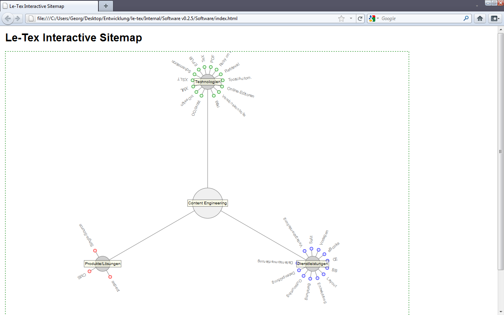
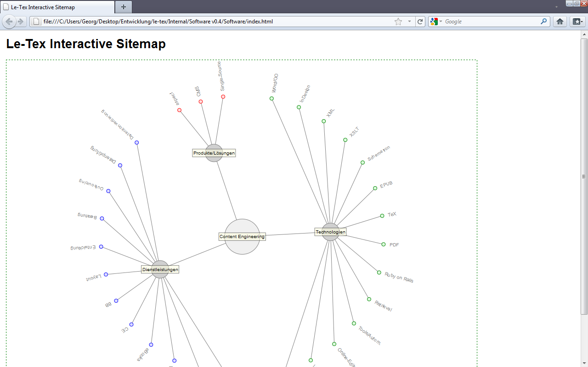
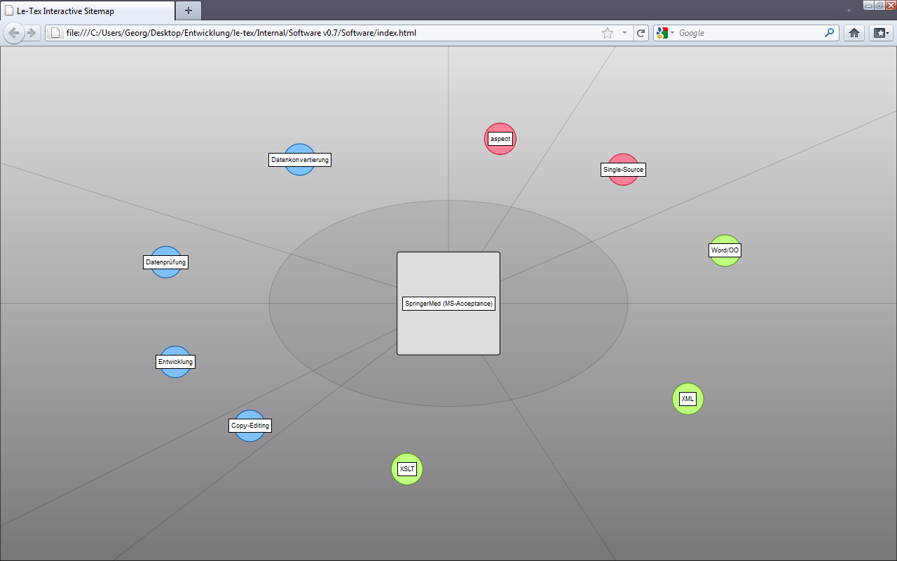

This first set of screenshots illustrates the evolution of the widget over the project period.
First the basic layout algorithm had to be design and implemented, then things like color and shading where added.
The development of such innovative interaction technology is a highly creative and exciting process, which I can recommend to any programmer interested in information visualization and human-computer interaction.

What does not become clear from the screenshots is the concept for interaction and animation.
Therefore I prepared a screencast which is uploaded to YouTube for public access.
The screencast shows an exemplary sequence of interactions between user and graph widget.
Interaction takes place by clicking the pages and dragging them into the center for accessing page-specific information (such as connected pages).

<iframe title="YouTube video player" src="//www.youtube.com/embed/PfOcENZHgCE?rel=0" frameborder="0" allowfullscreen="yes"></iframe>

Personally, this was a very interesting and exciting project for me and I am happy to share this information with you.
If you have questions or would like to know more about my experiences with developing such kind of technology do not hesitate to contact me.

*Historical Archive (2009–2017):* [← Previous: Describing the Structure of Information](/posts/2011_06_21_information_structure_notation/) | [Next: Blog Timeline Widget →](/posts/2011_06_27_blog_timeline_widget/)
