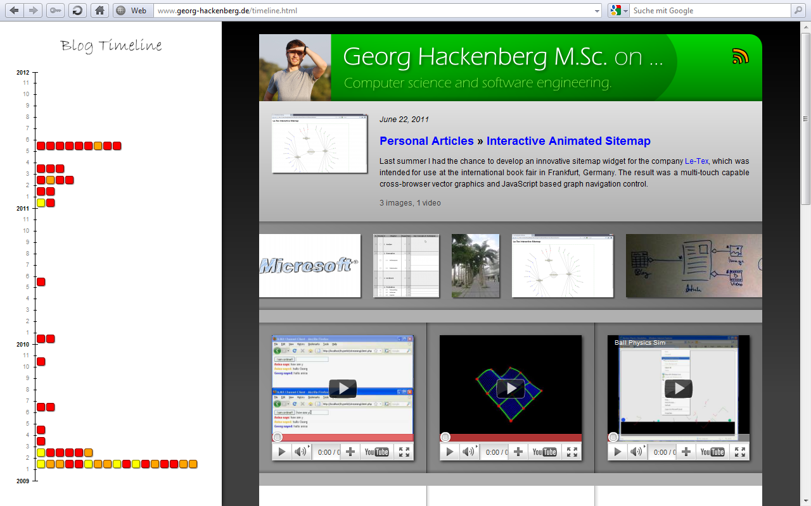
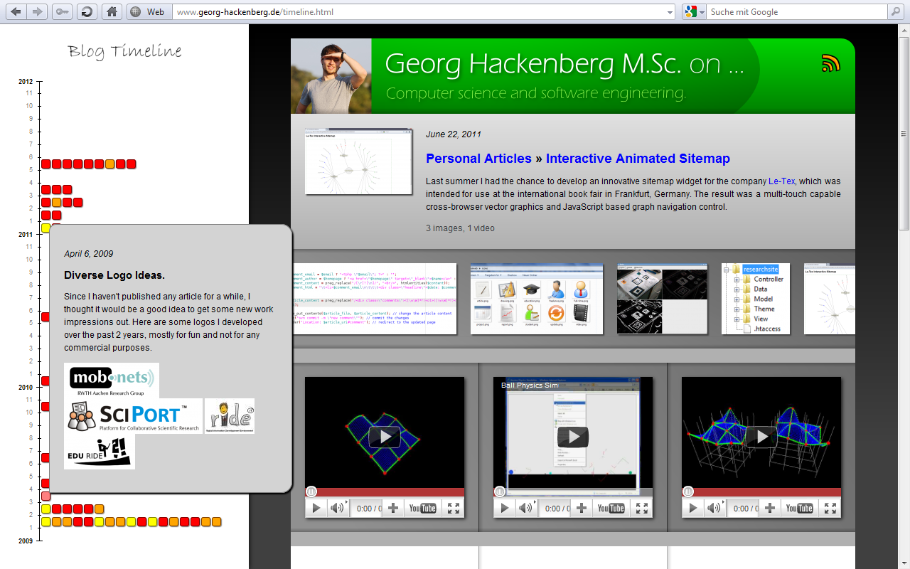

First here are the screenshots of the widget taken with the latest stable Opera web browser (though other recent browsers can be used as well).
The left image shows the interface directly after loading the web page.
The right image illustrates the effect when hovering over dots in the timeline fading in a bubble with information about the underlying blog post.

The usage of the widget is further illustrated in the following YouTube video.
You can see how interaction with the widget is carried out.
Please note that the YouTube video shows a previous version of the widget with less visual detail.

<iframe title="YouTube video player" src="//www.youtube.com/embed/B1Sn_RlfH6A?rel=0" frameborder="0" allowfullscreen="yes"></iframe>

The widget is probably not perfect yet, but I think you get a good idea what future visualization and navigation concepts might look like.
The platform for developing and running these applications is already available with all major modern web browsers.
It is now on us to use these capabilities the best way we can.
