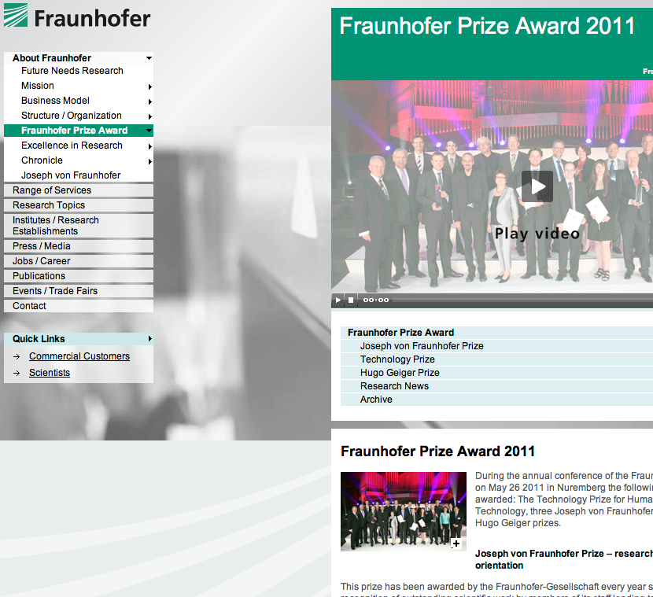
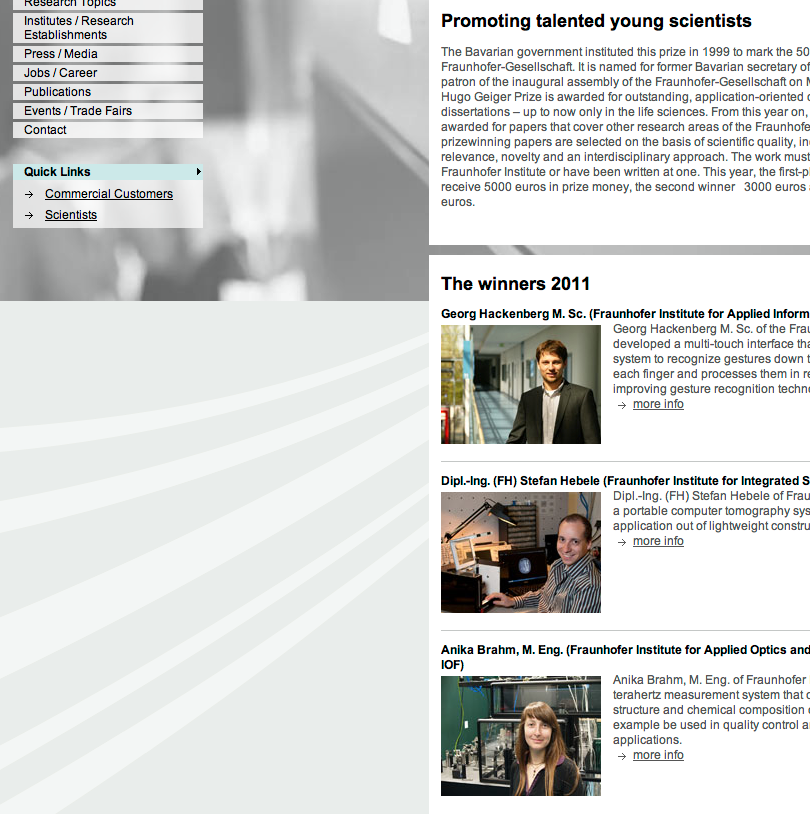

Each year the Hugo Geiger Prize awards three outstanding application-oriented Master thesis'.
The prize has been set up by the [Bavarian Ministry for Economy, Infrastructure, Transport and Technology](http://www.stmwivt.bayern.de/).
It is named after the German politician [Hugo Emil Otto Conrad Geiger](http://de.wikipedia.org/wiki/Hugo_Geiger), who served besides other roles as the patron when founding the Fraunhofer Association back in 1949.
Since then the association has developed to Europe's largest organization for applied research and development services employing more than 18,000 professionals.

It has been a great honor to receive this prestigious award and to participate in the well-staged award ceremony moderated by [Ursula Heller](http://www.br-online.de/bayerisches-fernsehen/muenchner-runde/muenchner-runde-moderator-heller-ID1202920745505.xml).
Amongst others the Chinese Minister of Science and Technology [Prof. Dr. Wan Gang](http://en.wikipedia.org/wiki/Wan_Gang) and the Bavarian Minister of the Interior [Joachim Herrmann](http://www.joachimherrmann.de/) gave interesting talks about the role of science for society and a commitment to globally sustainable technological and social progress.
About my conclusion I am still pondering. `;)`
