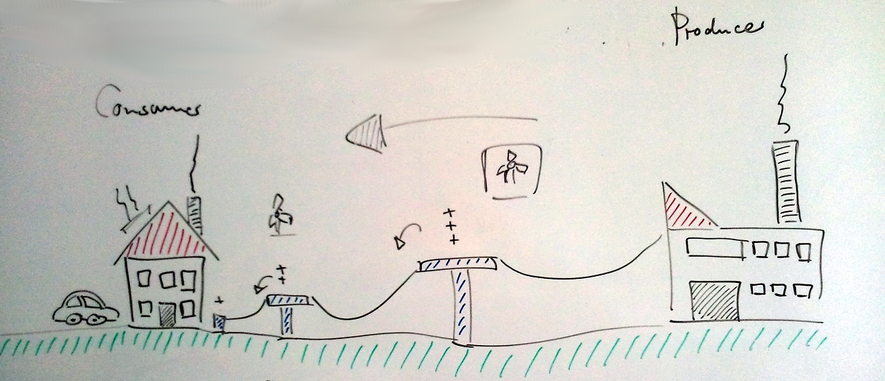
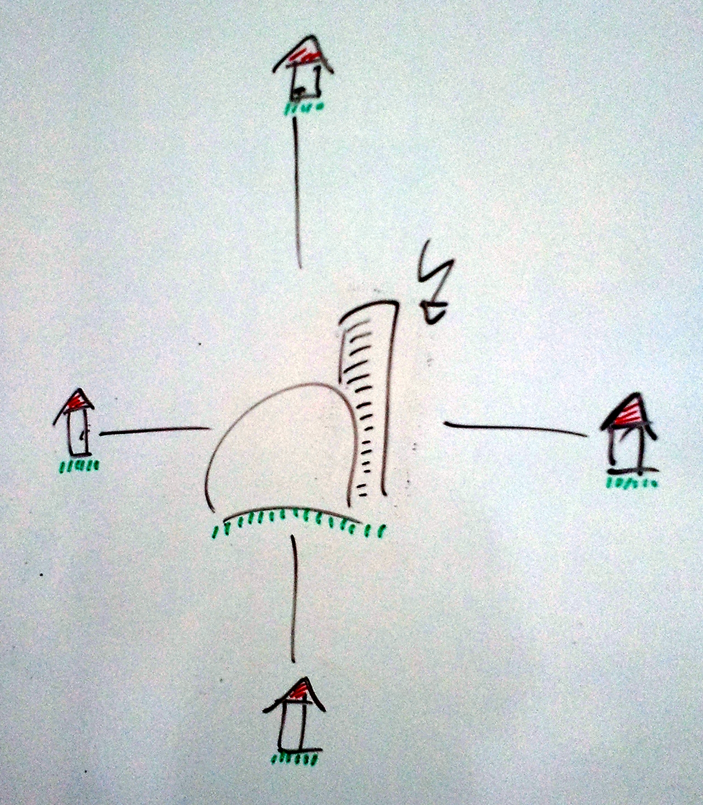
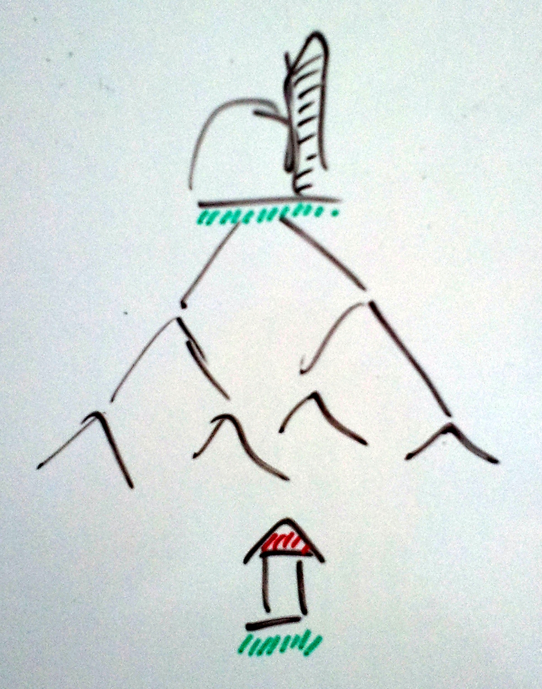
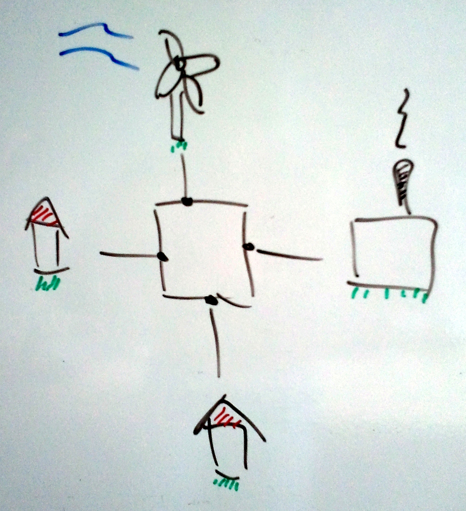
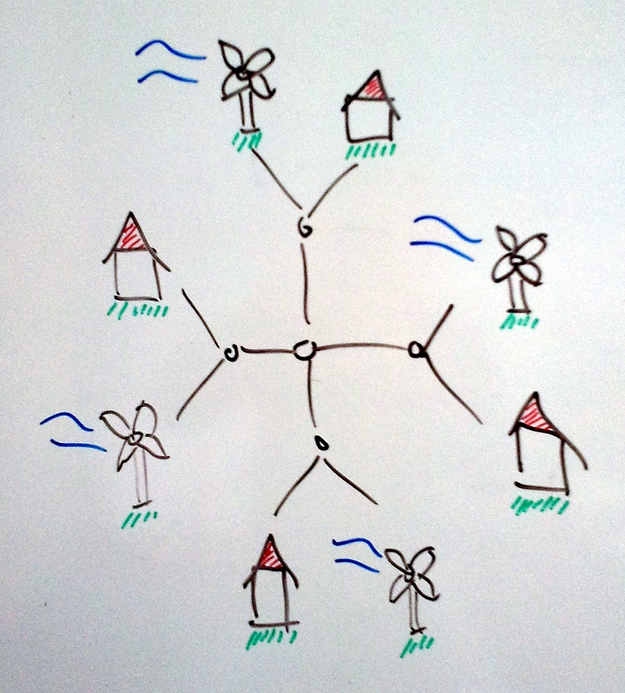

When you try to understand the challenges humanity is facing when it comes to energy supply, you probably want to start with learning about the current infrastructure and the way it works.
Simplified, the current energy network is a rather simple structure supporting single direction energy flow from producers to consumers.
Producers can be anything from local water works to regional coal-fired power plants to nuclear power plants.
The producers supply the energy network with energy, usually at high voltages for transportation over long distances.
The more local a physical energy network (the cables) get, the lower voltages are used over the wire.
Power transformers are used to down-scale the voltage level at discrete locations in the network.

This end-to-end view (producer to consumer) is complemented by illustrations of the general network topology.
Currently, more centralized topologies are in place where energy is produced at few locations and distributed in a star-like fashion (first diagram).
When taking the down-scaling of voltages for local distribution networks into the picture, the topology changes into a tree-like structure with a trunk and branches (second diagram).
In general, many different topologies can be imagined as for example a more bus-like setup where everybody is connected directly (third diagram).
But finally, the political vision is to de-centralize the generation of energy e.g. through local wind power but keeping the network connected for energy and energy-related information exchange (fourth diagram).

In sum I believe the energy domain offers an exciting playground for contributing to a technological revolution with planned and anticipated sustainable impact.
I will try to keep you posted about the process and the progress of this national and international ambition.
I think we all can be excited about an energetic but energy-neutral future society and life foundation.
