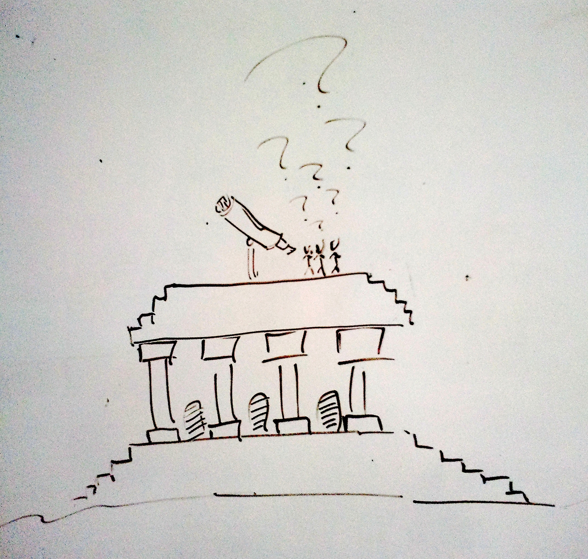

A typical picture people have in mind when talking about science is "standing on the shoulder of giants".
I believe this metaphor to fit well, not at last because of the education and tools necessary to get to the point where you can start contributing to humanity's knowledge universe (both in content and encoding).
My illustration picks up this idea, but uses a Greek temple as the giant instead (after all I come from a technical domain and as such I feel more affine to architectural craftwork than mythical creatures `;-)`).

Now, at the edge of our knowledge (the roof of the temple) we have tools (e.g. a telescope) in place to watch and observe the unexplored space.
While doing so, question start forming in our heads and discharging into the scientific community, some questions being more important than others, some being more difficult, some being more theoretical, some more practical.

As I come across new mental pictures of the scientific process I will try to keep you posted.
Personally, I am very much interested in illustrating such complex ecosystems and their governing rules.
