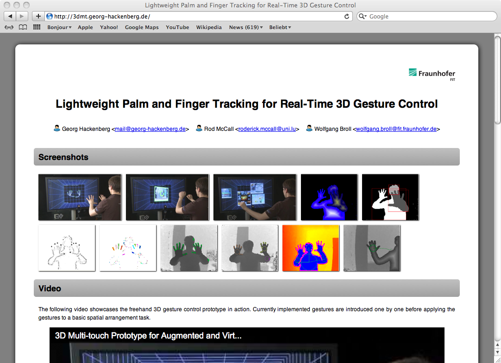
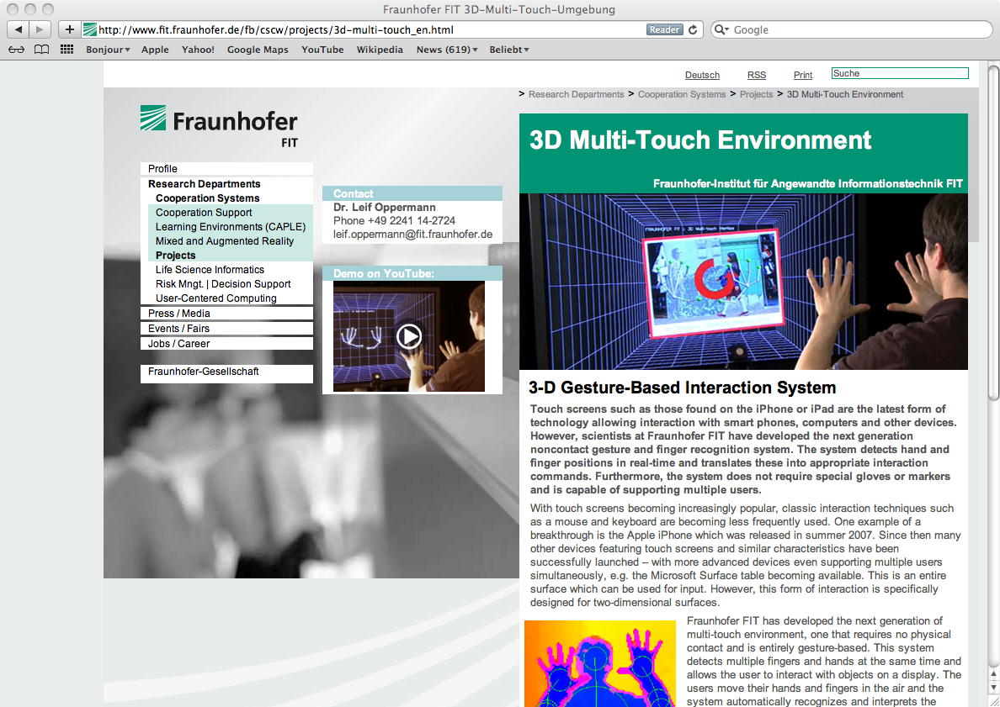

First, there is one single page providing all important online information from *screenshots* to *videos* to *papers* to *presentations* to *links*, which you can find at [3DMT (at) Georg Hackenberg (dot) de](http://3dmt.georg-hackenberg.de).
This website has also been submitted to the [2011 Joint Virtual Reality Conference (JVRC)](http://www.nottingham.ac.uk/jvrc2011/index.aspx) *WOW-factor competition* from which we expect intersting and valuable expert feedback.
Second, there is the [Fraunhofer FIT project website](http://www.fit.fraunhofer.de/fb/cscw/projects/3d-multi-touch_en.html) which provides further institute-related information about the project.

We hope these two public website will make it easier for you to get the information you need and to get in touch about collaborations and other forms of involvement around the topic of *3D interaction*.
We believe it is just the beginning of this branch of technology and there is great potential for solutions and products on a quickly emerging market.
So better jump on the train!
`;-)`
