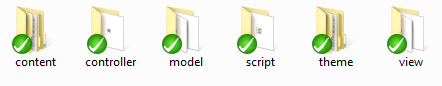
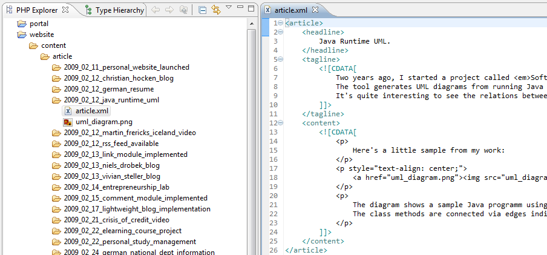
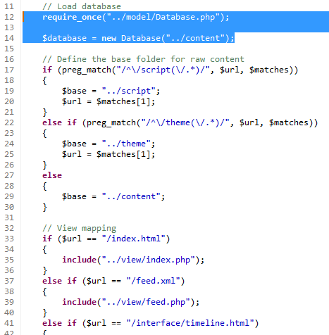
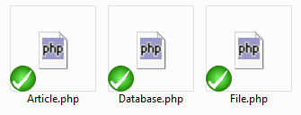
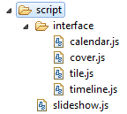
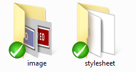
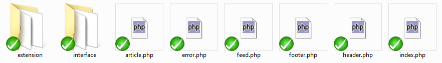

The files of the blog are distributed to six folders:
(1) **content** stores variable data for each blog installation,
(2) **controller** contains PHP scripts that descide how to process HTTP requests,
(3) **model** contains PHP classes that reflect the content,
(4) **script** contains JavaScripts required by the user interface,
(5) **theme** contains Cascading Stylesheets and images for the user interface,
and (6) **view** contains PHP scripts that generate the HTTP responses.

The **content** folder mainly contains the **article** folder, which stores the individual blog articles.
Each blog article is represented by a folder whose name contains the article **date** and **id** (e.g. `2009_02_11_personal_website_launched`).
This folder contains the **article.xml** file and other documents such as images or PDFs.
The XML file provides information about the article **headline**, **tagline** and **content**.
Typically, the **content** section refers to the attached documents.

The **controller** folder currently only contains a single script called **main.php**.
The purpose of the script is to load the content using the **model** classes and to redirect the HTTP request to the respective **view**.
Further, for raw content such as images or PDF documents the correct file path is derived using a **base** path and the request URL.

The **model** folder currently contains three classes:
(1) **Database** represents the root of the content model,
(2) **Article** represents a blog article with direct access to headlines, taglines, content and attached documents,
and (3) **File** represents attached documents.
The class implementations typically use file system operations and the *SimpleXML API* for loading the stored content.

The **script** folder currently contains JavaScript files for
(1) the Dashboard image slideshow and
(2) the four different blog interfaces (Calendar, Cover, Tile, Timeline).
Scripts (and **theme**) are separated from **content** to make it possible to exchange content while keeping appearance and interactivity.

The **theme** folder contains (1) images and (2) Cascading Stylesheets.
Through separating theme files from content it is possible to have several blog installations run the same theme with different content.
It is intended to install themes by checking out a respective theme SVN repository.

The **view** folder currently contains scripts for
(1) the **header** and **footer** (reused by other views),
(2) the **index** (also called *Dashboard*) and **article** pages,
(3) the **RSS feed**,
and (4) the **error** page.
Further, scripts are provided for specific files extensions such as **JPEG** or **PDF**.
In particular, the image extension scripts provide functionality to rescale and crop image files.
Finally, the folder **interface** contains the views for the different blog interfaces (Calendar, Cover, Tile, Timeline).

These files are currently all that is required for running a simple PHP/XML blog.
If you are interested you can access the entire sources via the public SVN repository: [http://svn.hyperkit-software.com/personalblog/](http://svn.hyperkit-software.com/personalblog/).
