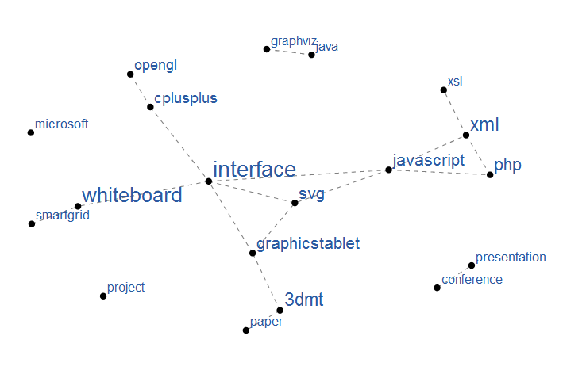
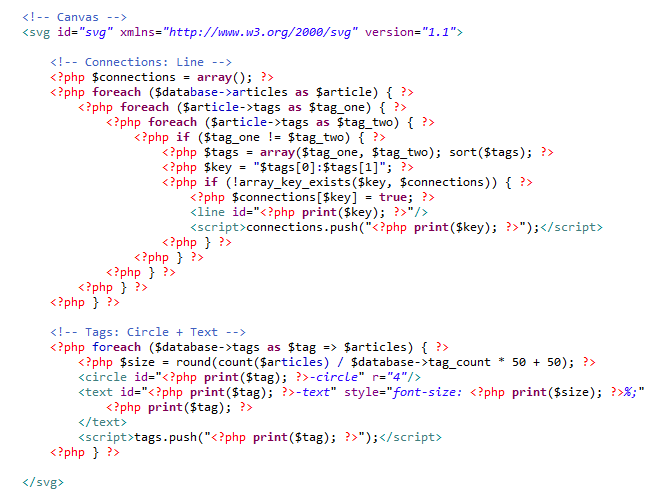
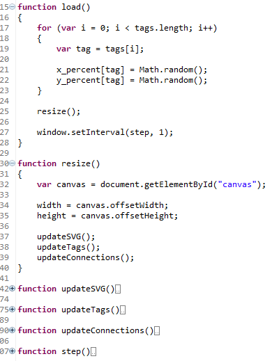

The implementation is compatible with recent versions of **Internet Explorer**, **Mozilla Firefox**, **Opera** and **Google Chrome/Apple Safari**.
The following image shows a sample output for this blog.

The graph is generated using **PHP**, layouted using **JavaScript** and rendered using **SVG**.
The PHP script basically generates lines for connections between tags, and circles/text elements for the tags themselves.
Most of the code is specific to my custom blogging API.

The JavaScript contains the magic behind the interface.
Upon page load the tags are arranged randomly on the canvas.
Then, an interval is started to move the tags to their final location step by step.
The update functions finally copy the layout algorithm values to the DOM SVG nodes.

Try it out yourself: `http://www.georg-hackenberg.de/interface/graph.html`.
If you would like to provide such interface for your own website, access the code via [http://svn.hyperkit-software.com/personalblog/](http://svn.hyperkit-software.com/personalblog/).
