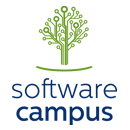
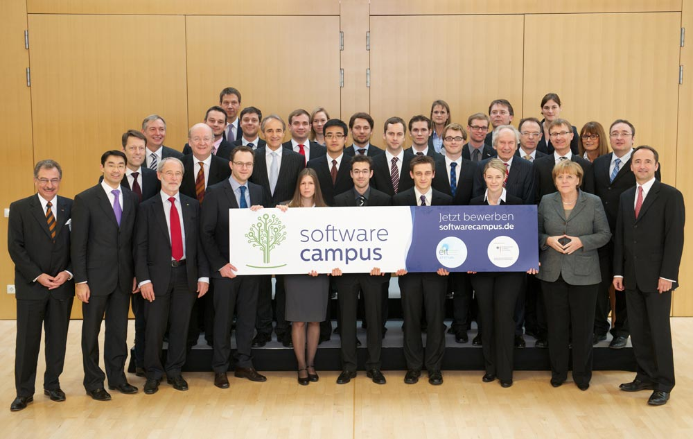

  

    
  

  The idea of **Software Campus** is to support Master and PhD students with funds for their very own research project (up to EUR 100.000) as well as contacts to relevant industry partners.
  From project funding the students are expected to learn how to manage projects in practice while the industry partners provide mentorship and soft skill training.
  In my case the project is centered around my work on energy systems and ICT (Information and Communication Technology) engineering for the future *smart grid*.
  Other topics include advanced dialog systems for online shops and smart city test beds.
  Overall, there is a wide selection of topics that address central future challenges for society and industry.

Industry partners include among others **Siemens**, **SAP**, **Software AG** and **Bosch**.
In my particular case I am affiliated to [Siemens Corporate Technology](http://www.siemens.com/corporate-technology/en/index.php), the R&D (Research and Development) branch of the Siemens AG.
The industry partner helps to sharpen the project vision, provides mentorship throughout the project and supports development of leadership skills in seminars and workshops.
Overall, this frameset provides a great opportunity for industry-driven research, feedback and focus.

Finally, here is a picture of the eleven selected pilot PhD students with the **German Chancellor Dr. Angela Merkel**, the **Vice Chancellor Dr. Philipp Roesler**, the founder of the *Scheer Group* **Prof. August-Wilhelm Scheer** and the CEO of the *SAP AG* **Jim Hagemann Snabe**.
This picture was taken at the [2011 National IT Summit](http://www.it-gipfel.de/) in Munich, an occasion where the German IT industry comes together and discusses past evolutions and future strategies.

Copyright 2011 Wolfram Scheible

I hope this article got you interested in the excellence program.
From what I have experienced so far I can tell it is a great chance for all participants including the PhD students and the companies.
Soon the application for the next round will be open.
Have a look at the official website and be prepared to apply!
