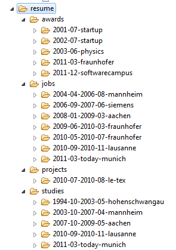
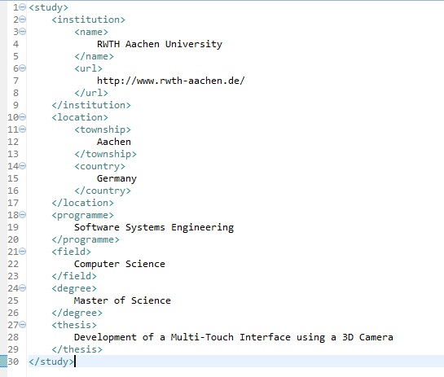
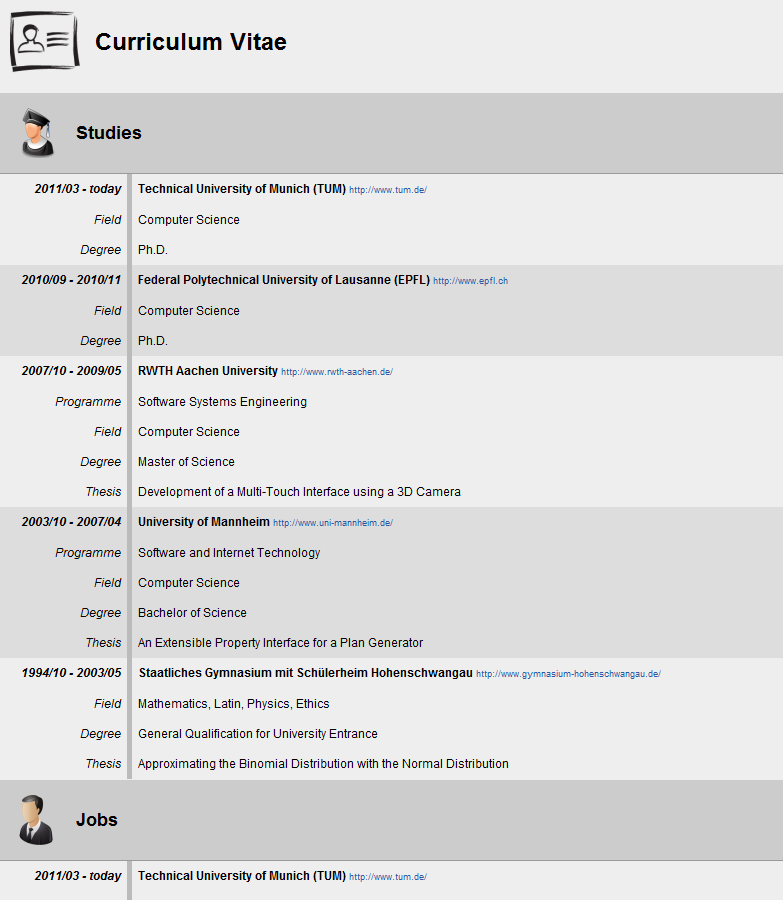
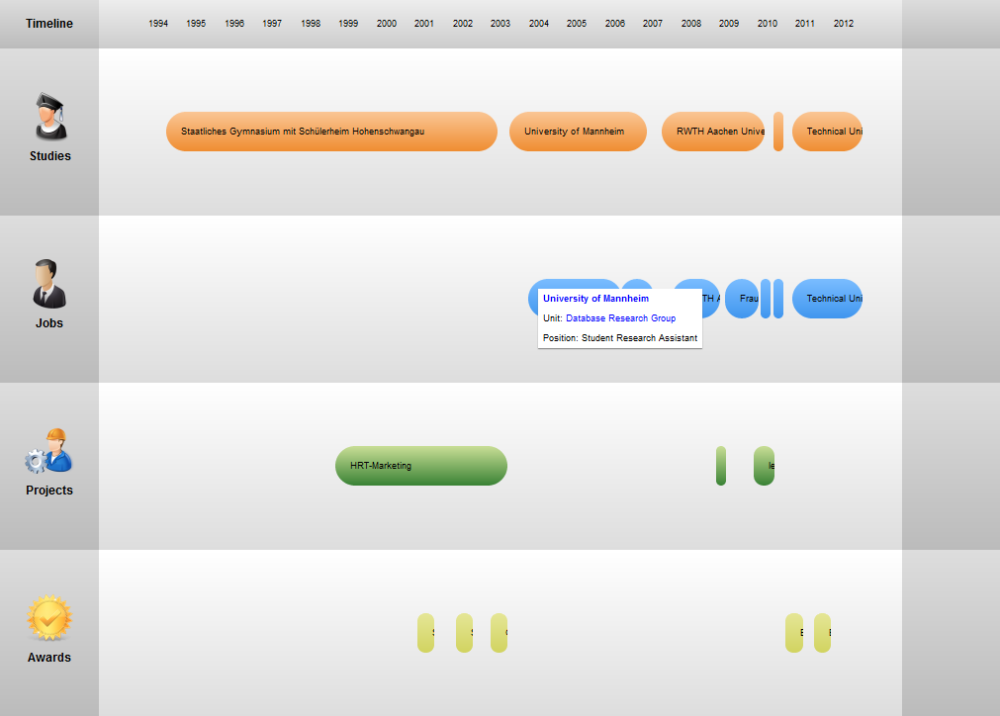

First let's have a look at the data files.
The following two screenshots show (1) the folder structure for storing resume data and (2) one example of an XML file for the *study* section of the resume.
The folders devide the resume into four sections: awards, jobs, projects and studies.
Each of these sections contains folders for the respective entries.
Their folder names contain information about the start and end dates.
The date information is stored in the folder names so that the entries can be ordered by file name.

The XML files contain information relevant for each entry.
For example study entries store the institution, the location, the programme, the field, the degree, etc.
For now I have implemented a limited selection of information which may be extended if necessary.

Now the great point about having resume data available in such XML format: You can build arbitrary visualizations for it.
For now I have worked on two variants: The tabular interface and the timeline interface.
The tabular interface immitates standard resume layouts.
Dates are printed to the left and information about the chapters of your life is given to the right.

A problem with the tabular layout is that temporal relations between e.g. study and job chapters are in many cases not explicit.
This is where the timeline layout tries to jump in: Each section (study, job, project, award) is given its own line and entries a placed on them with different colors.
To quickly understand the concept just have a look at the following screenshot.

I hope you liked the idea of having your resume back'ed by an XML data storage.
At least, having the data available now I will see where I can go in terms of visualization and interaction.
Maybe something nice and useful comes out!
