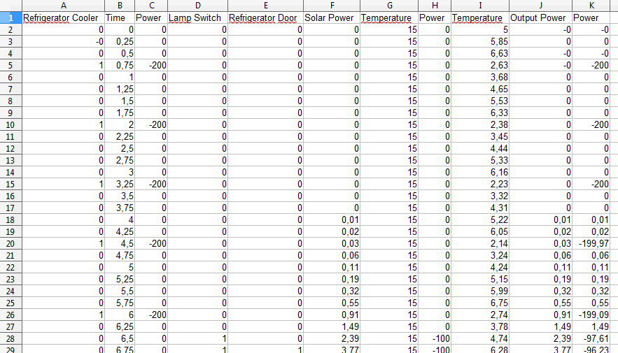
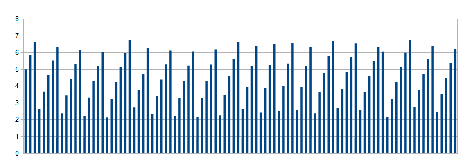
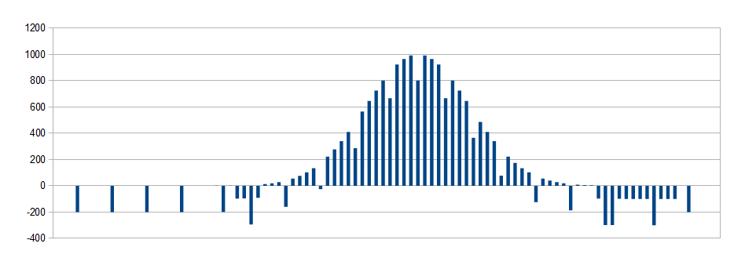
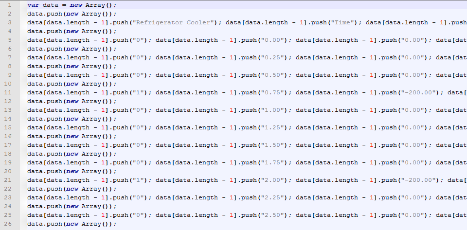

In the video the individual system components are displayed with respective icons.
Between the components physical measurements such as temperature and electric power as well as user interaction events are shown.
Finally, the simulation time runs from midnight of the previous day to mignight of the current day.
See yourself:

<iframe title="YouTube video player" src="//www.youtube.com/embed/rY7ZRqeVVUo?rel=1" frameborder="0" allowfullscreen="yes"></iframe>

The visualization in the video is based on a data series generated by the simulation.
Originally, the simulation data is available in CSV (comma-separated values) format as shown in the next screenshot.
The format has been selected to allow importing the simulation data directly into Microsoft Excel and other spreadsheet solutions.

The representation in spreadsheet format has the great advantage, that charts can be easily built from it.
In the following, two examples are provided:
(1) The temperature curve for the interior of the refrigerator.
And (2) the electric power curve for the household at the interface to the low-voltage net.
This is another from of visualization that helps analyzing system behavior.

Refrigerator temperature curve

Household power curve

The visualization itself is rendered inside a browser with JavaScript and SVG.
Therefore the data series is transformed into a two-dimensional JavaScript array.
The transformation is straightforward: Rows in the spreadsheet are array indices in the first dimension, while columns are indices in the second dimension.

Right now we are working on extending the simulation model and developing better visualizations on top.
Ultimalte goal is a true large-scale simulation model for developing and testing smart control algorithms.
