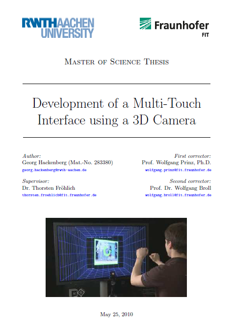
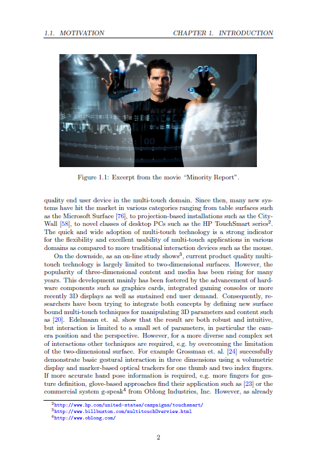
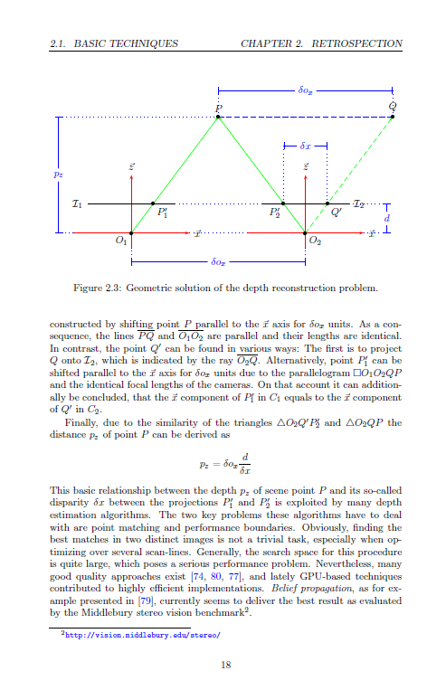
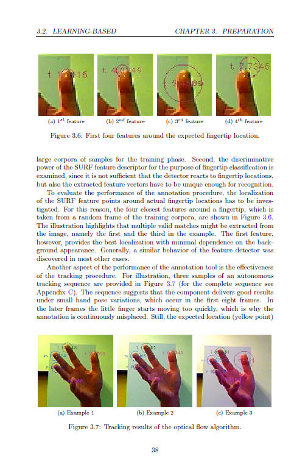
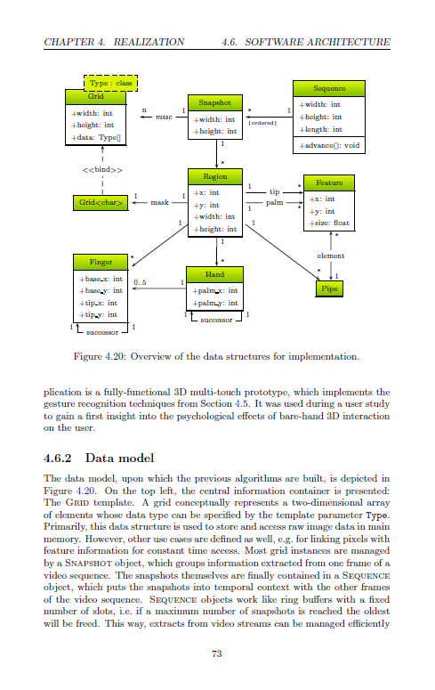

The thesis documents two approaches I have tried to implement computer vision based 3D hand gesture interaction.
The more promising approach is selected to implement a first prototype for evaluation with users.
Finally, the findings are summarized and future work is listed.

  

  

  

  

If you have feedback or questions please do not hestitate to contact me!
Use the comment feature below to give other people the chance to engage into the discussion.
