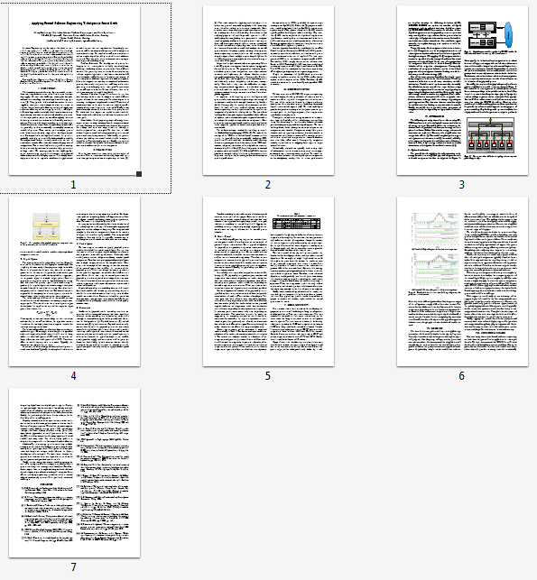
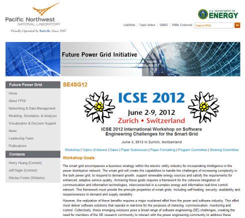

Here's a little teaser for the paper.
The conference is held at the beginning of June in Zurich, Switzerland.
This year's main theme is "sustainable software for a sustainable world".
After the conference days you will be able to access the full version of the paper as part of the conference proceedings.
The conference proceedings are typically distributed both in digital and in printed format.

If you are interested to read more about SE4SG access the workshop website.
The website provides interesting background information about the organizations and people behind the scenes.
Overall, SE4SG is a first step towards broadening the discussion about interfacing software engineering and electrical engineering for sustainable energy supply.

I hope this article gave you an insight into current developments in my area of research.
Stay tuned along the road towards a better energy future!
It's a topic that matters for everybody.

*Historical Archive (2009–2017):* [← Previous: 3D Multi-Touch Master Thesis](/posts/2012_03_15_3d_multi_touch_master_thesis/) | [Next: Introducing Timeline Navigation and Facebook Like →](/posts/2012_04_12_timeline_navigation_facebook_like/)
