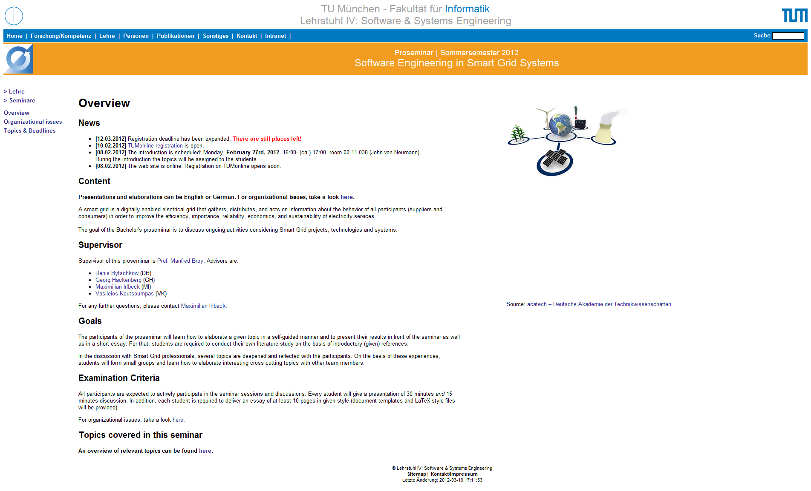

For now you can find more information about the seminar on the [seminar webpage](http://www4.in.tum.de/lehre/seminare/SS12/sesgs/index.shtml):

Stay tuned on our smart grid learning and teaching activities!
