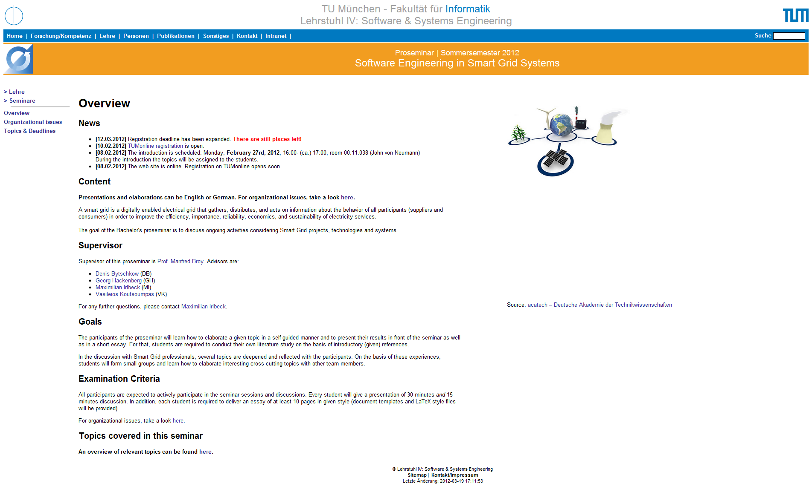

For now you can find more information about the seminar on the [seminar webpage](http://www4.in.tum.de/lehre/seminare/SS12/sesgs/index.shtml):

Stay tuned on our smart grid learning and teaching activities!

*Historical Archive (2009–2017):* [← Previous: Introducing Timeline Navigation and Facebook Like](/posts/2012_04_12_timeline_navigation_facebook_like/) | [Next: Second report on smart grid simualtion. →](/posts/2012_04_19_smart_grid_simulation_report/)
