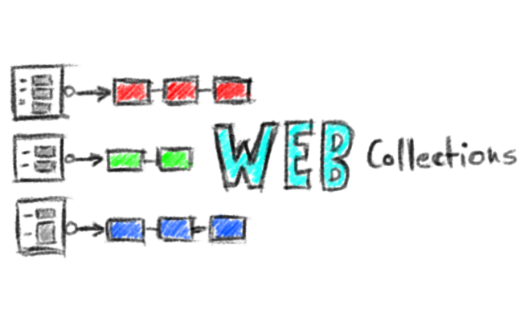
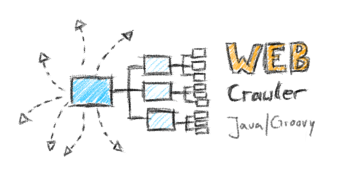
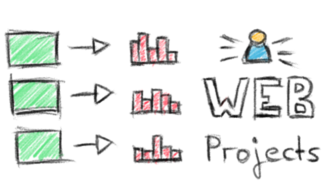
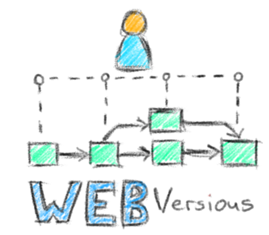
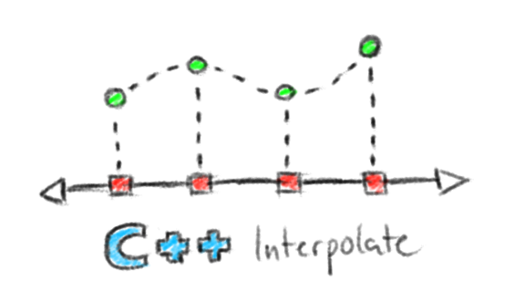
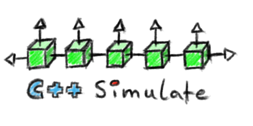
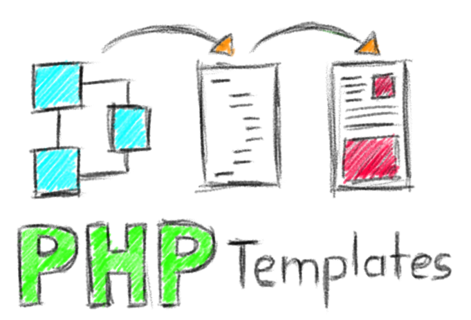
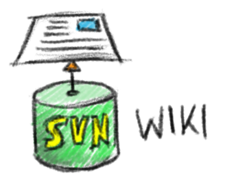
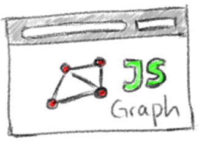
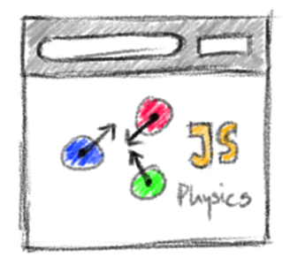

You can also find the logos on the [Hyperkit Software Portal](http://www.hyperkit-software.com/index.html).
In the following, the logos are grouped thematically.
The first group includes everything concerning the **Web**

The second group is dedicated to **C++** projects.
[C++](http://en.wikipedia.org/wiki/C%2B%2B) is a programming language developed by Bjarne Stroustrup at Bell Labs in 1979.
Today, it is one of the most popular programming languages with many application areas.

The third group is formed of **PHP** and **SVN** projects.
[PHP](http://en.wikipedia.org/wiki/PHP) is another popular programming language mainly used for web sites.
Instead, [SVN](http://en.wikipedia.org/wiki/Apache_Subversion) is a file versioning tool mainly used for team work.

The final group is compiled from **JavaScript** projects.
[JavaScript](http://en.wikipedia.org/wiki/JavaScript) is a last popular programming language that runs in the browser and allows to develop highly interactive web experiences.

Sketching these logos has been a matter of minutes with a Tablet PC and MyPaint.
Of course, in most projects the sketches won't be used as the final versions of the logo.
But they serve as immediate drivers towards the final version.
