I was working on tracking (human) motion fast and with high quality.
We used a virtual skeleton and infrared markers.

[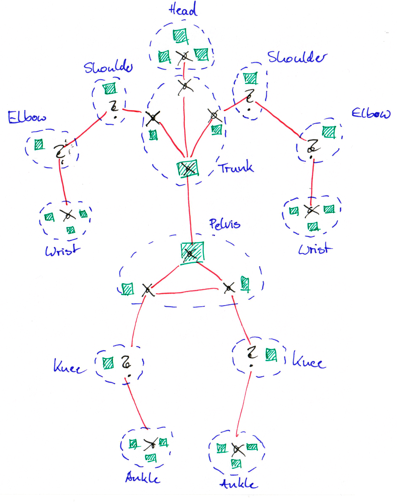](./skeleton.png)

The overall tracking problem could be split in a number of subproblems:
Finding the configuration of the trunk, the hip and the shoulders.

[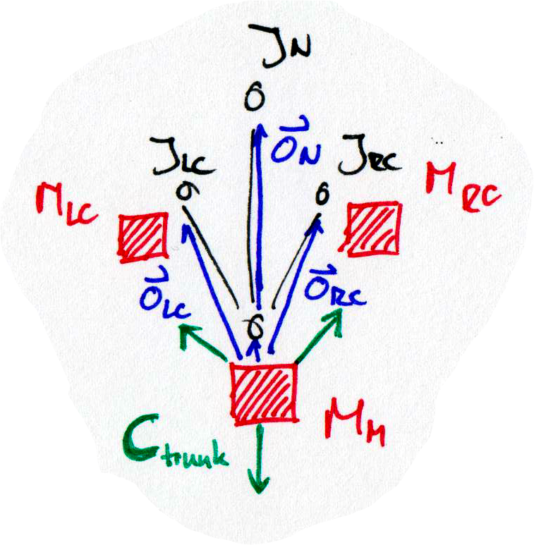](./skeleton_trunk.png)
[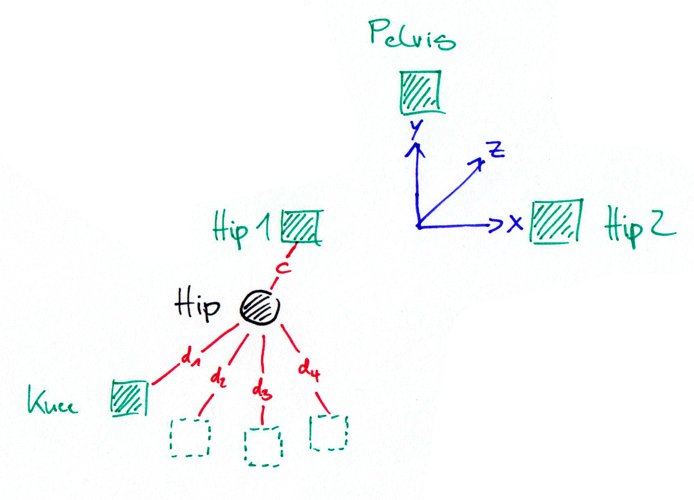](./skeleton_hip.png)
[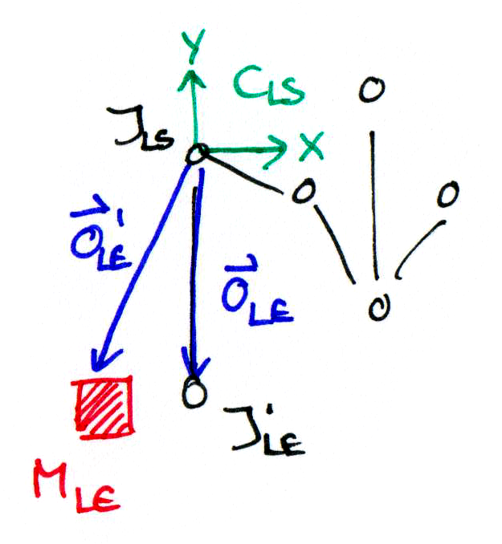](./skeleton_shoulder.png)

To improve the workflow I created software models of the skeleton.
For rendering I used [POV-Ray](http://www.povray.org/).

[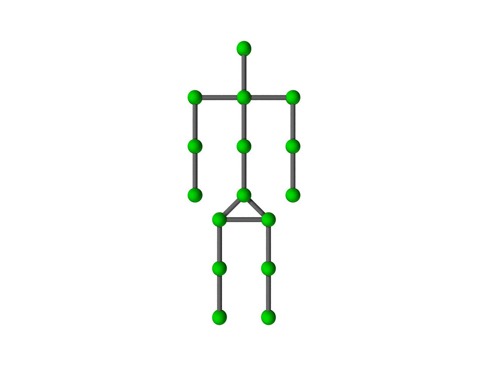](./povray_skeleton.png)
[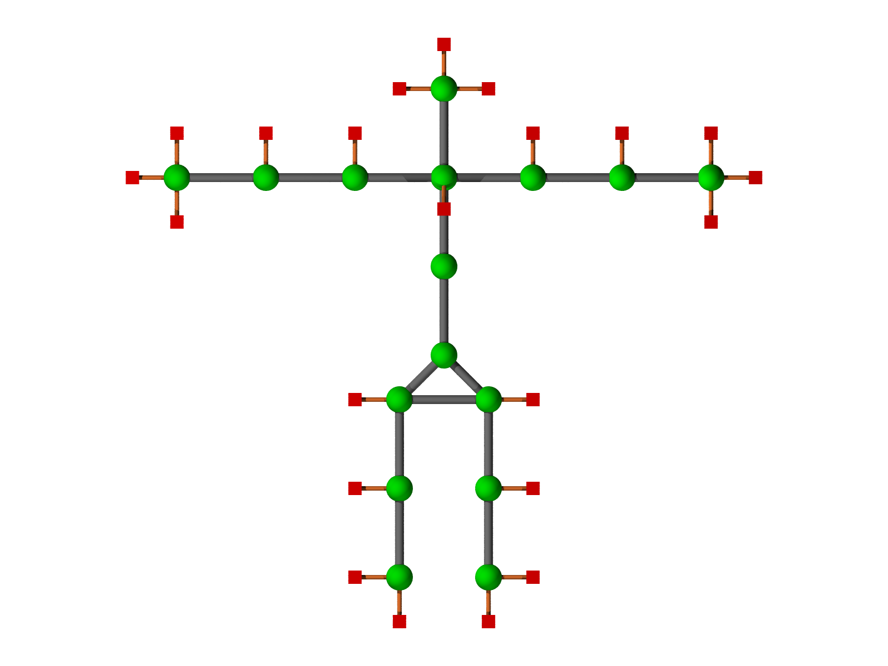](./povray_markers.png)
[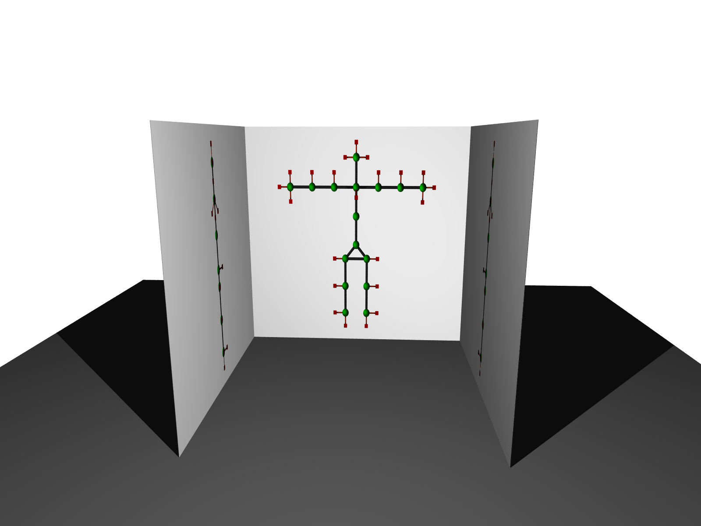](./povray_scene.png)

Finally, I was working on an interface for testing the data structures and algorithms.
First I created some scetches.

[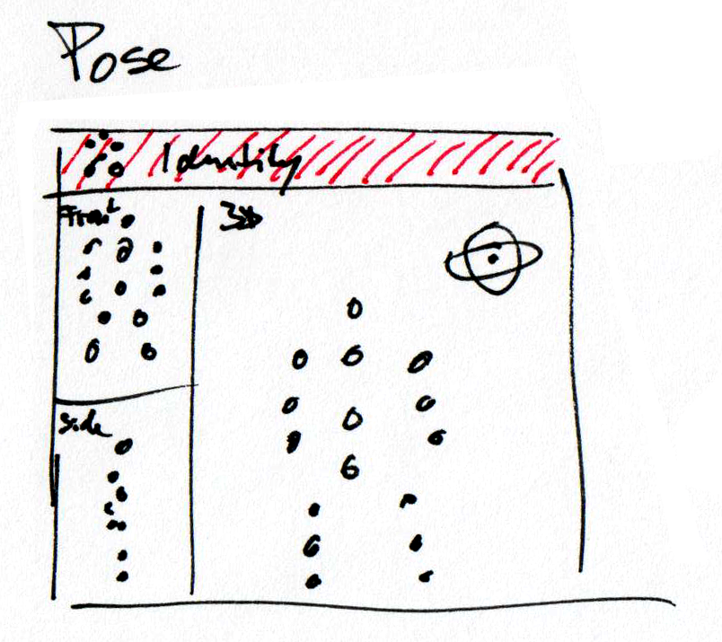](./interface_scene.png)
[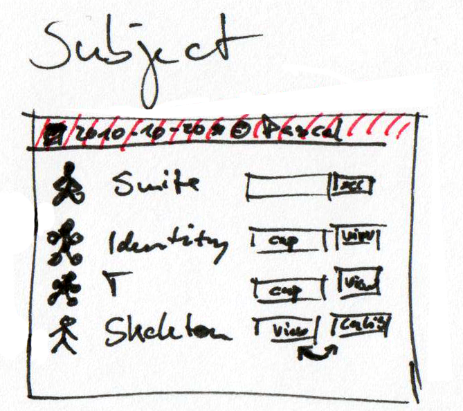](./interface_subject.png)
[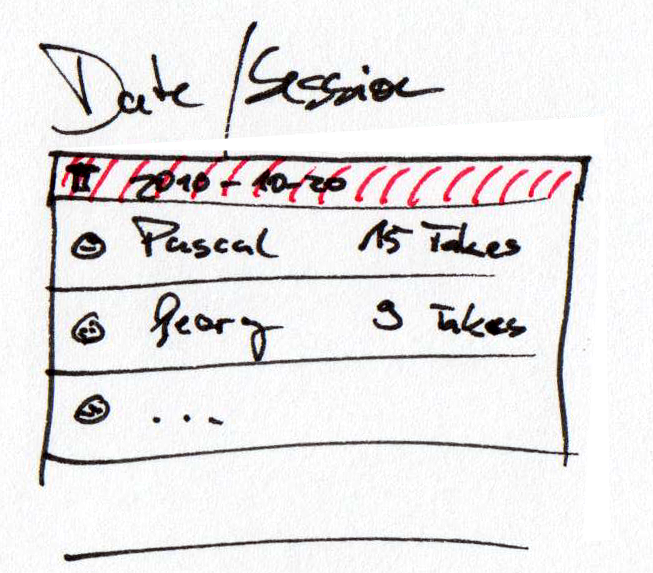](./interface_list.png)

Then I implemented a prototype in [C++](http://en.wikipedia.org/wiki/C%2B%2B) and [Qt](http://qt.nokia.com/products/).
The prototype was based on a custom C++ plugin framework.

[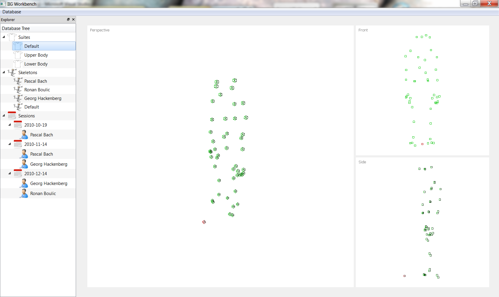](./screenshot.png)

In another article I might show you how the custom C++ plugin framework was implemented.
It was actually a very interesting experience for me, as plugin framework design turns out to be a challenging task.
