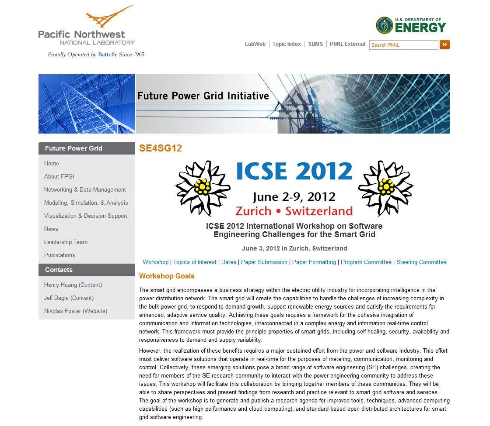

If I find enough time and Internet access in Zurich I will try to blog a little bit about the event, the topics and the people.
For now have a look at the workshop website linked below to get more information.
Software engineering is starting to discover and explore the field of energy systems and - in particular - smart grids.
It's an exciting process with many opportunities!

