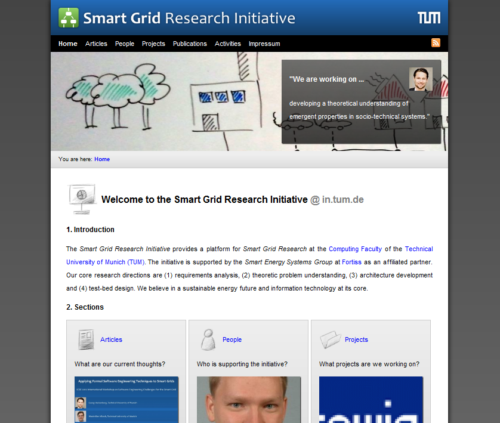

To keep this article short I will only provide a screenshot and a link to the new website.
The web design is a custom development of our group.
We tried to make navigation simple and give short taglines that convey our ideas and philosophies.

