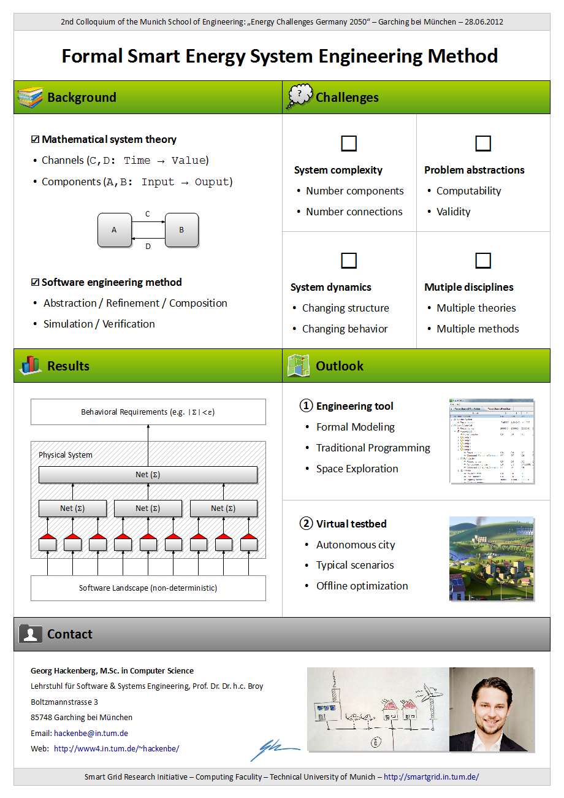

The poster illustrates our current state of research in the direction of formal software and systems engineering methods for the energy system domain.
In particular, due to the interdisciplinary nature of the colloquium our scientific background and current challenges are highlighted.
From there preliminary results and an outlook are given.

