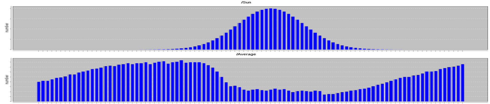

The diagram shows two data series from the study.
The upper series shows the solar energy available at each time step.
The series is provided to the tool in CSV format, i.e. the study can be adapted to other scenarios easily.
The lower series shows the average temperature of the 20 refrigerators.
The selected control strategy cools down the refrigerators when solar energy is available.
At night time the temperatures are rising to an upper limit.

*Historical Archive (2009–2017):* [← Previous: Follow-Up on Denis' MSE Article](/posts/2012_07_03_mse_follow_up/) | [Next: How to Scale Refrigerator Powering Strategies →](/posts/2012_07_16_behavior_space_exploration/)
