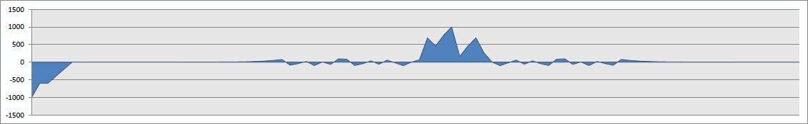
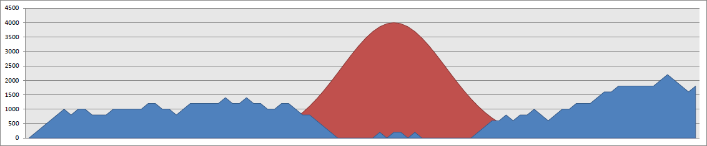

The system model defines 20 refrigerators, a solar plant and a powerhouse.
The goal of exploration was to minimize the integral over the power balance.
The first diagram depicts the obtained power balance curve after 96 time steps.
Clearly, we achieve much better balance than in previous runs without an integrated powerhouse.

The second charts depicts the available energy per time step.
The curves for the solar panel and for the powerhouse are overlayed.
Interestingly, the powerhouse truely stops producing when sun energy is high.
Further, the powerhouse operates on average at around 1000 Watt.
This is due to the fact that the model defines optimal efficiency for this value.

In one of the next steps we will try to integrate this model with an energy storage to reduce usage of fossil energy sources.
