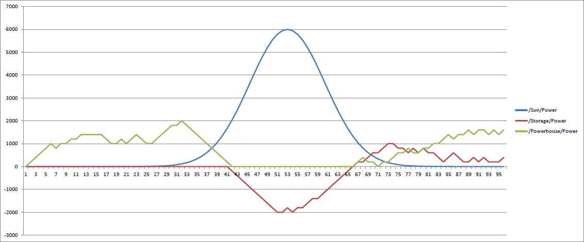

The following diagram shows the power curves for the three components: Solar panel, powerhouse and energy storage.
Again, the powerhouse shuts down when plenty of solar energy is available.
In contrast, the energy storage loads during high solar power times and unloads afterwards.

Interestingly, unloading the storage helps to delay powerhouse usage a little therefore decreasing fossil energy usage.
In following studies we investigate the usage of energy storage further!
