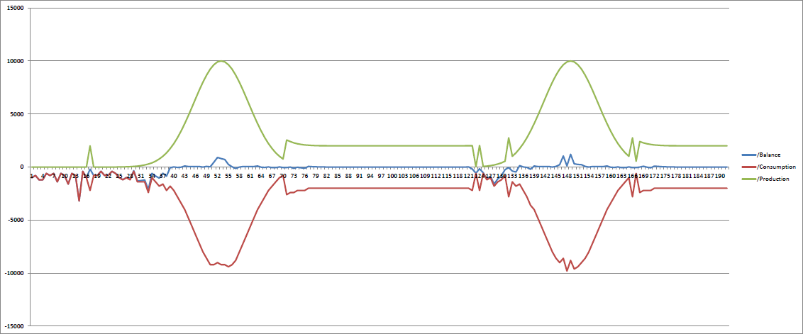
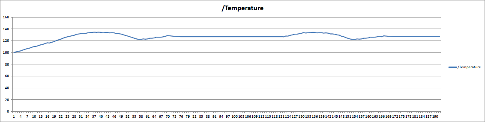
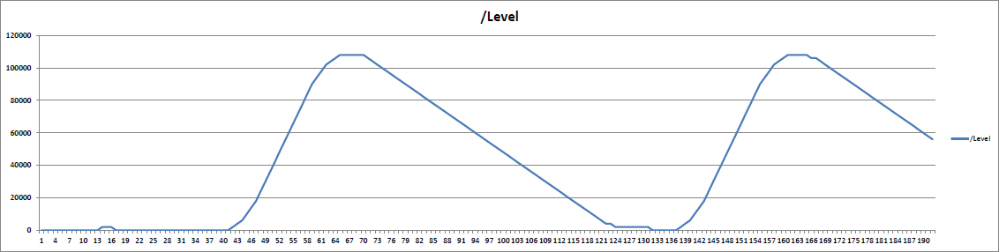

The underlying model contains a solar panel, an energy storage and 20 refrigerators.
The optimization starts at midnight with zero energy in the storage.
Therefore, until sunrise the energy balance is negative.
After sunrise the energy balance stabilizes around the zero point even across the following night and day.

To understand the system behavior the following two diagrams show the average temperature and storage level over time.
Clearly, a temperature drop can be observed at day time while the storage level rises.
After sun power is gone the storage level drops to feed the refrigerators with energy.

In the next steps we plan to extend the model with other types of energy components.
Further, we are working on scaling the problem to village, city and country sizes.
