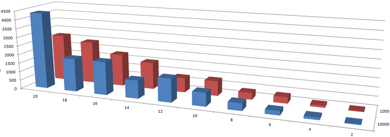

The following diagram shows how the learning algorithm performs for a number of problem scales.
The horizontal axis shows the problem scale.
The depth axis shows configuration parameters for the learning algorithm.
The vertical axis finally shows the number of steps after which the individuals converge to a stable behavior.

These are just first results.
Stay tuned for more detailed explanations and practical applications!
