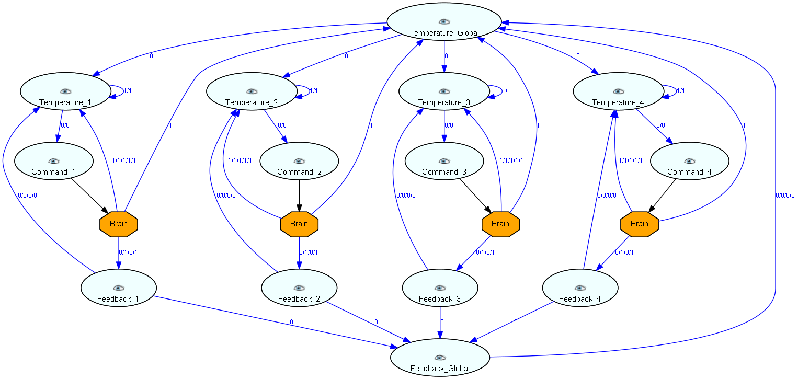
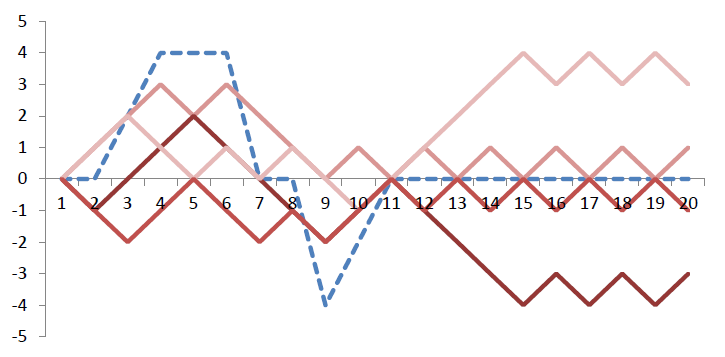

The model defines four individuals in terms of a temperature, a command and a feedback observation.
Based on the individuals a global temperature and feedback observation is defined.
The command observations are used to control the individual and global temperature curves.
The feedback observations are used to indicate how close the temperature curves are to desired behavior.
Finally, learning components (i.e. the brains) are defined to take the control decision depending on previous temperature values and feedback obtained.

When running the model the temperature curves typically behave randomly in the beginning before converging to stable behavior.
The following chart shows a sample trace, where the individuals converge to desired individual and collective behavior after 11 time steps only.
The red lines represent the local temperatures, while the dashed blue line depicts the global temperature.

Beyond the presented we have been working on larger problems including up to 100 individuals.
The approach seems to be feasible for exploring goal-oriented behavior in various situations.
We hope to make a valuable contribution for introducing machine learning techniques into classical software engineering.
