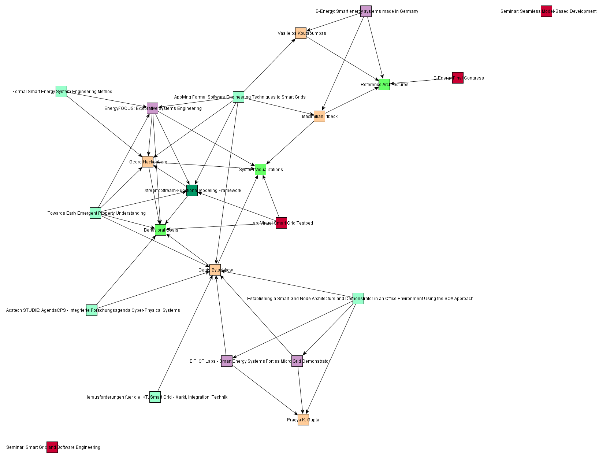
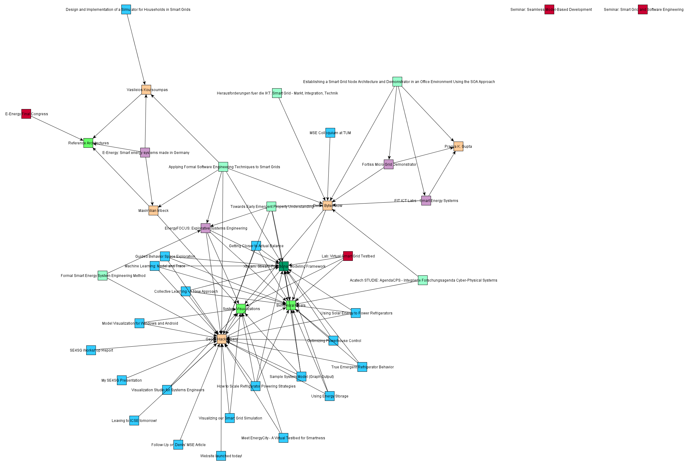
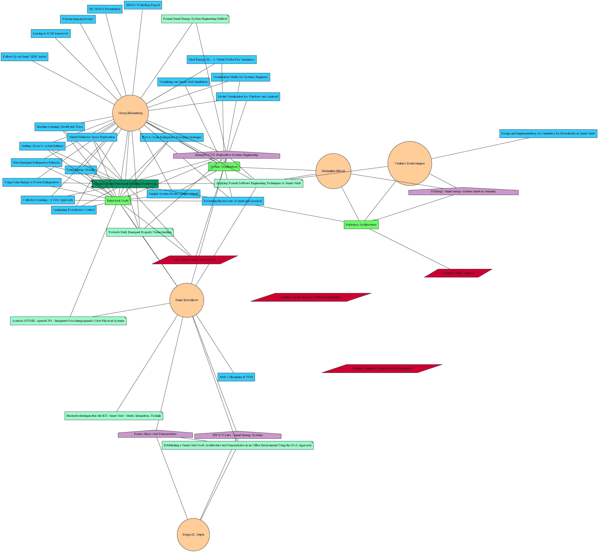

For understanding the contents we generated a respective graph representation.
Nodes represent content items, while edges represent their interconnections.
The graph is finally layouted and rendered with yFiles, a free and powerful software for graph structures.
The first graph includes everything but the blog articles to reduce the graph size.
We can identify three lines of research, (a) the one centered around [reference architectures](http://smartgrid.in.tum.de/topics/reference_architectures/) and [E-Energy](http://smartgrid.in.tum.de/projects/2008_e-energy/), (b) the one centered around [behavioral goal modeling](http://smartgrid.in.tum.de/topics/emergent_properties/) and [Xtream](http://smartgrid.in.tum.de/tools/xtream/), and (c) the one centered around the [fortiss living lab](http://smartgrid.in.tum.de/projects/2010_fortiss_demonstrator).

The second graph also includes the blog articles.
Clearly, most content is centered around [behavioral goal modeling](http://smartgrid.in.tum.de/topics/emergent_properties/) and [system visualization](http://smartgrid.in.tum.de/topics/system_visualization/).
In the other areas we intend to provide more content about our activities and research progress in the coming months.
We hope the content will help gaining a clearer picture of our topics and their connection.

Here again the same graph with Graphviz as the underlying data format and layout engine.
Both tools are integrated seamlessly into our web content management system to support intuitive graphical content analysis.
As a side note: In the future we intend to integate a live content graph view into our website showing always up-to-date results.

From the graph visualizations it becomes what topics are covered with respective content at the moment and what areas we need to work on.
A goal could be to span the smart grid topic space and fill the gaps in between.
From this procedure we expect to get a clear map of our domain projected onto our interests.
