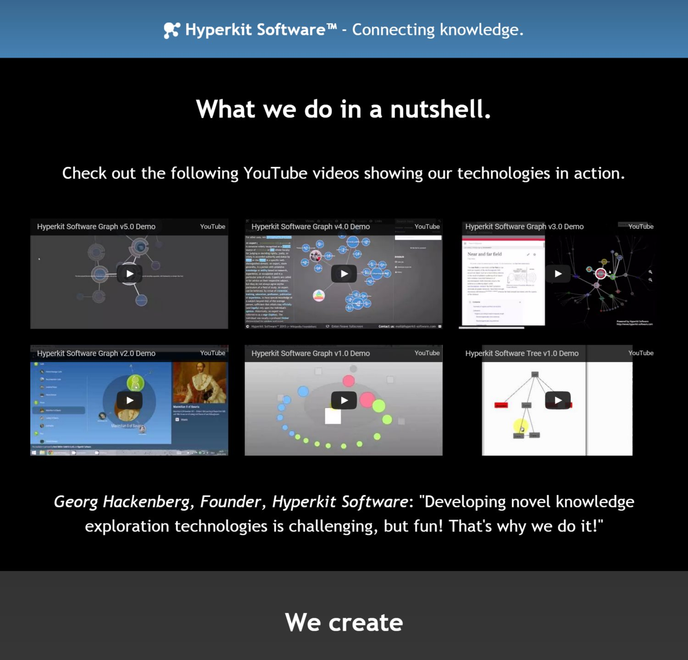

Here is a screenshot of the website. Check it out to get more information about our technologies, our products, our customers and our team! We would be happy to do projects with you some day! ;)

*Historical Archive (2009–2017):* [← Previous: zumida goes online!](/posts/2015_07_20_zumida_goes_online/) | [Next: First mechatronics engineering workbench screenshots! →](/posts/2015_09_23_mechatronics_engineering_workbench_screenshots/)
