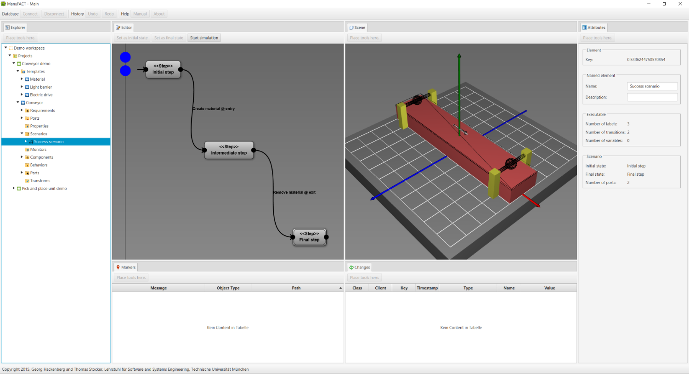
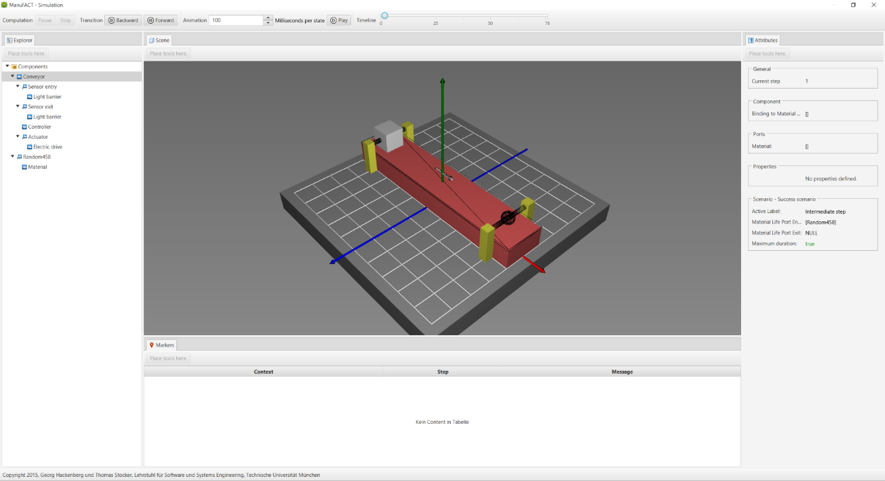
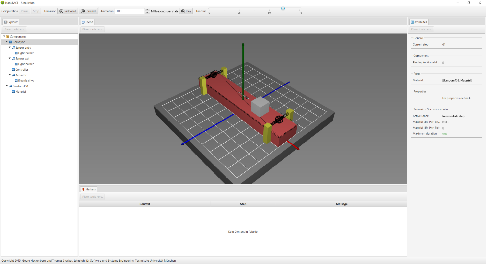

The following screenshot shows the user interface for creating models of mechatronic systems.
On the left side the **explorer** tab shows the model elements as tree view.
In the middle, four tabs are provided: The editor, the scene, the markers and the changes tab.
The **editor** tab allows one to modify model elements (e.g. the scenario selected in the explorer tab).
The **scene** tab shows the relevant geometric elements of the mechatronic system model instead.
The **markers** tab provides information about problems in the mechatronic system model.
The **changes** tab displays a log of modifications that have been made on the model recently.
Finally, on the right side the **attributes** tab shows all attributes of the currently selected element.

One core feature of the workbench is the **simulation-based testing** of the mechatronic system model with respect to requirements.
In the following four screenshots are provided of a single simulation run on the previous model.
The screenshots show how the mechatronic system is transporting material (gray cube) from some entry to some exit point (wired spheres).
The requirement states that the transportation process is finished within a predefined amount of time.
In the given case the simulation-based test can be finished successfully and the requirement is fulfilled.

In the coming weeks I plan to prepare a YouTube video explaining the tool and the underlying engineering method in greater detail.
So stay tuned if you are interested in the topic!
