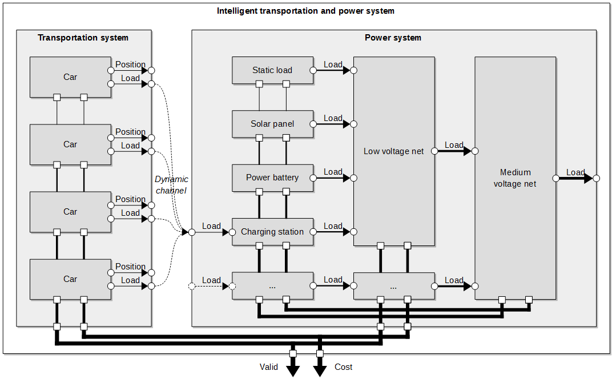

The challenge in this work was to find an appropriate model capturing both the transportation system (i.e. vehicles) and the power system (i.e. charging stations, solar panels, low-voltage nets, etc.). While we had models in place for the transportation system and the power system alone, their integration still was an open issue. What we came up with for integrating those two models were **dynamic** channels between the car components of the transportation system and the charging station components of the power system. The dynamic channels allow one to model spontaneous interactions between those components in case the car is close to the charging station.

We use this model to study the effect of the transportation system onto the power system and vice versa. For example, we try to answer the question what happens in case high solar radiation can be observed or low stationary battery states of charges are available. Therefore, the model includes a global cost function combining operational cost of both the transportation system and the power system. Then we use advanced dynamic programming techniques to solve the optimal control problem approximately. Soon we will provide first analysis results for those studies!
